# SIPX - Software Design Document (SDD)

> **Versão:** 0.1.0
> **Data:** 2026-03-30
> **Status:** Em desenvolvimento (v0.3.0)
> **Inspiração principal:** [httpx](https://www.python-httpx.org/) — API Pythônica, sync/async, extensível
> **Referências de implementação:** [sipd](https://github.com/initbar/sipd), [sipmessage](https://github.com/spacinov/sipmessage), [sip-parser](https://github.com/alxgb/sip-parser), [PySipIvr](https://github.com/ersansrck/PySipIvr), [sip-resources](https://github.com/miconda/sip-resources)
> **Outras inspirações:** [pyVoIP](https://github.com/tayler6000/pyVoIP), [aiosip](https://github.com/Eyepea/aiosip), [pysipp](https://github.com/SIPp/pysipp), [PySIPio](https://pypi.org/project/PySIPio/), [b2bua](https://github.com/sippy/b2bua), [katariSIP](https://github.com/klocation/katarisip), [SIP-Auth-helper](https://github.com/pbertera/SIP-Auth-helper), [callsip.py](https://github.com/rundekugel/callsip.py)
> **Python:** 3.13+
> **Licença:** MIT

---

## 1. Visão Geral

**sipx** é uma biblioteca SIP (Session Initiation Protocol) para Python, inspirada no httpx, projetada para ser **simples, de alta performance e extensível**. Permite criar desde scripts de automação VoIP até sistemas completos com IVR, TTS, STT e integração com IA.

### 1.1 Objetivos

| Objetivo | Descrição |
|---|---|
| **Simplicidade** | API limpa e intuitiva inspirada no httpx (`client.invite()`, `client.register()`) |
| **Sync + Async** | `Client` e `AsyncClient` com mesma API |
| **Eventos declarativos** | `@event_handler('INVITE', status=200)` como decoradores |
| **Alta performance** | Zero-copy parsing, lazy body parsing, connection pooling |
| **Conformidade RFC** | RFC 3261, 2617, 7616, 4566, 3264, 4733 e extensões brasileiras |
| **Extensibilidade** | Transports plugáveis, body parsers, auth methods via ABCs |
| **Multi-plataforma** | CLI, FastAPI, TUI (Textual), scripts de automação |
| **Automação de voz** | Suporte a IVR, TTS, STT, DTMF, RTP para integração com IA |

### 1.2 Público-Alvo

- Desenvolvedores construindo automações VoIP/SIP
- Sistemas de IVR com IA (TTS/STT)
- Ferramentas CLI para teste e diagnóstico SIP
- Aplicações FastAPI com sinalização SIP
- TUIs para monitoramento de chamadas

---

## 2. Arquitetura

### 2.1 Diagrama de Camadas

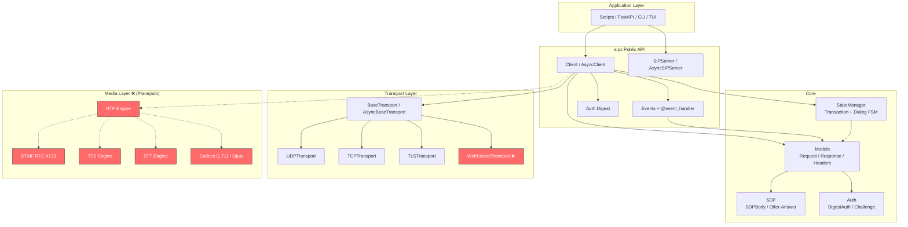

> 🔴 = Não implementado

### 2.2 Estrutura de Pacotes

```
sipx/
├── __init__.py          # Public API exports
├── _client.py           # Client + AsyncClient (alto nível)
├── _server.py           # SIPServer + AsyncSIPServer
├── _events.py           # Events + @event_handler decorator
├── _fsm.py              # Transaction + Dialog + StateManager
├── _types.py            # Enums, DataClasses, Exceptions, Type Aliases
├── _utils.py            # Constants (EOL, HEADERS, REASON_PHRASES), logging
├── main.py              # Entry point (vazio)
│
├── _models/
│   ├── __init__.py      # Re-exports
│   ├── _message.py      # SIPMessage (ABC), Request, Response, MessageParser
│   ├── _header.py       # HeaderContainer (ABC), Headers, HeaderParser
│   ├── _body.py         # MessageBody (ABC), SDPBody, BodyParser
│   └── _auth.py         # Auth, DigestAuth, DigestChallenge, AuthParser
│
├── _transports/
│   ├── __init__.py      # Lazy loading
│   ├── _base.py         # BaseTransport (ABC), AsyncBaseTransport (ABC)
│   ├── _udp.py          # UDPTransport, AsyncUDPTransport
│   ├── _tcp.py          # TCPTransport, AsyncTCPTransport
│   └── _tls.py          # TLSTransport, AsyncTLSTransport
│
├── _media/              # ❌ PLANEJADO
│   ├── __init__.py
│   ├── _rtp.py          # RTP send/receive (RFC 3550)
│   ├── _dtmf.py         # DTMF RFC 4733 + RFC 2833 + SIP INFO
│   ├── _codecs.py       # G.711 (PCMU/PCMA), Opus, etc.
│   ├── _tts.py          # Text-to-Speech adapter
│   └── _stt.py          # Speech-to-Text adapter
│
├── _srtp/               # ❌ PLANEJADO
│   └── _srtp.py         # SRTP (RFC 3711)
│
└── _contrib/            # ❌ PLANEJADO
    ├── _ivr.py          # IVR builder
    ├── _fastapi.py      # FastAPI integration
    └── _cli.py          # CLI tools
```

---

## 3. Conformidade com RFCs

### 3.1 RFCs Implementadas

| RFC | Título | Módulo | Status |
|-----|--------|--------|--------|
| **3261** | SIP: Session Initiation Protocol | `_client`, `_models`, `_fsm`, `_server` | ✅ Core implementado |
| **2617** | HTTP Digest Authentication | `_models/_auth.py` | ✅ Completo |
| **7616** | HTTP Digest (SHA-256) | `_models/_auth.py` | ✅ Completo |
| **8760** | Digest Algorithm Comparison | `_models/_auth.py` | ⚠️ Parcial |
| **4566** | SDP: Session Description Protocol | `_models/_body.py` | ✅ Completo |
| **3264** | Offer/Answer Model com SDP | `_models/_body.py` | ✅ Completo |
| **3581** | Symmetric Response (rport) | `_client.py` (Via header) | ⚠️ Parcial |

### 3.2 RFCs Necessárias (Não Implementadas)

| RFC | Título | Prioridade | Módulo Planejado |
|-----|--------|------------|------------------|
| **3550** | RTP: Real-time Transport Protocol | 🔴 CRÍTICA | `_media/_rtp.py` |
| **3551** | RTP/AVP Profile | 🔴 CRÍTICA | `_media/_codecs.py` |
| **4733** | DTMF via RTP (telephone-event) | 🔴 CRÍTICA | `_media/_dtmf.py` |
| **2833** | DTMF via RTP (legacy) | 🟡 ALTA | `_media/_dtmf.py` |
| **3711** | SRTP: Secure RTP | 🟡 ALTA | `_srtp/_srtp.py` |
| **3263** | SIP: DNS/SRV Locating | 🟡 ALTA | `_client.py` |
| **3327** | SIP: Path Header | 🟡 ALTA | `_models/_header.py` |
| **3515** | SIP: REFER Method | 🟡 ALTA | `_client.py` (stub existe) |
| **3265** | SIP: SUBSCRIBE/NOTIFY | 🟡 ALTA | `_client.py` (stub existe) |
| **3262** | SIP: PRACK (100rel) | 🟢 MÉDIA | `_client.py` (stub existe) |
| **3311** | SIP: UPDATE Method | 🟢 MÉDIA | `_client.py` (stub existe) |
| **3428** | SIP: MESSAGE Method | 🟢 MÉDIA | `_client.py` (implementado) |
| **3903** | SIP: PUBLISH Method | 🟢 MÉDIA | `_client.py` (stub existe) |
| **3323** | SIP: Privacy Mechanism | 🟢 MÉDIA | `_models/_header.py` |
| **3325** | P-Asserted-Identity | 🟢 MÉDIA | `_utils.py` (header definido) |
| **7118** | SIP over WebSocket | 🟢 MÉDIA | `_transports/_ws.py` |
| **6665** | SIP: Event Framework | 🟢 MÉDIA | `_events.py` |
| **5765** | SIP-I (ISUP interworking) | 🟢 MÉDIA | `_contrib/_sipi.py` |

### 3.3 SIP-I (Interworking Brasil/Internacional)

| Spec | Título | Status |
|------|--------|--------|
| ITU-T Q.1912.5 | SIP-I: ISUP/SIP Interworking | ❌ Não implementado |
| ANATEL Res. 717 | Regulamentação VoIP Brasil | ❌ Não implementado |
| SIP-I Headers | P-Charging-Vector, P-Access-Network-Info | ⚠️ Headers definidos em `_utils.py` |

---

## 4. Componentes Detalhados

### 4.1 Client (`_client.py`)

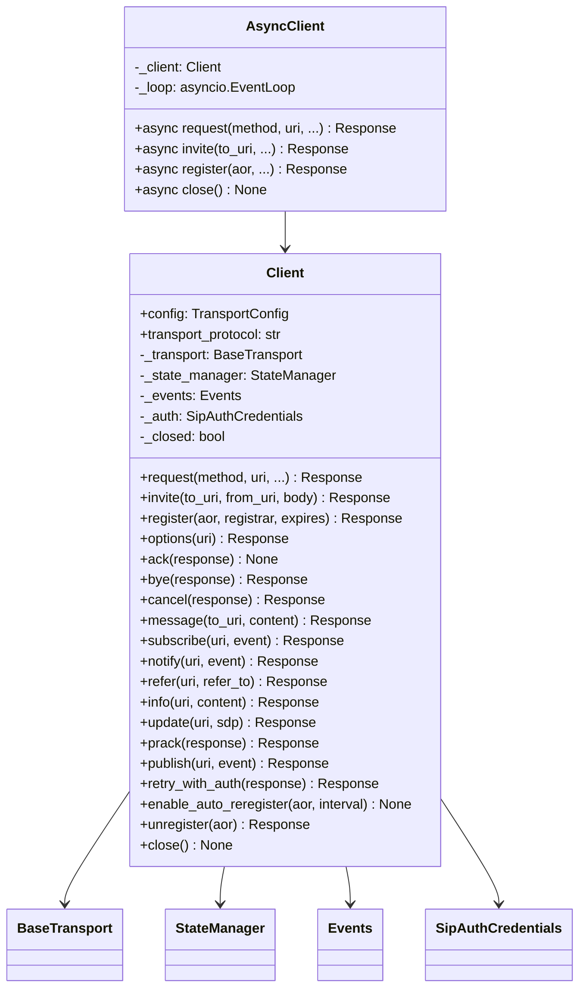

**API inspirada no httpx:**
```python
# httpx style
response = httpx.get("https://example.com")

# sipx style
response = client.invite("sip:bob@example.com")
response = client.register("sip:alice@pbx.com")
```

### 4.2 Events System (`_events.py`)

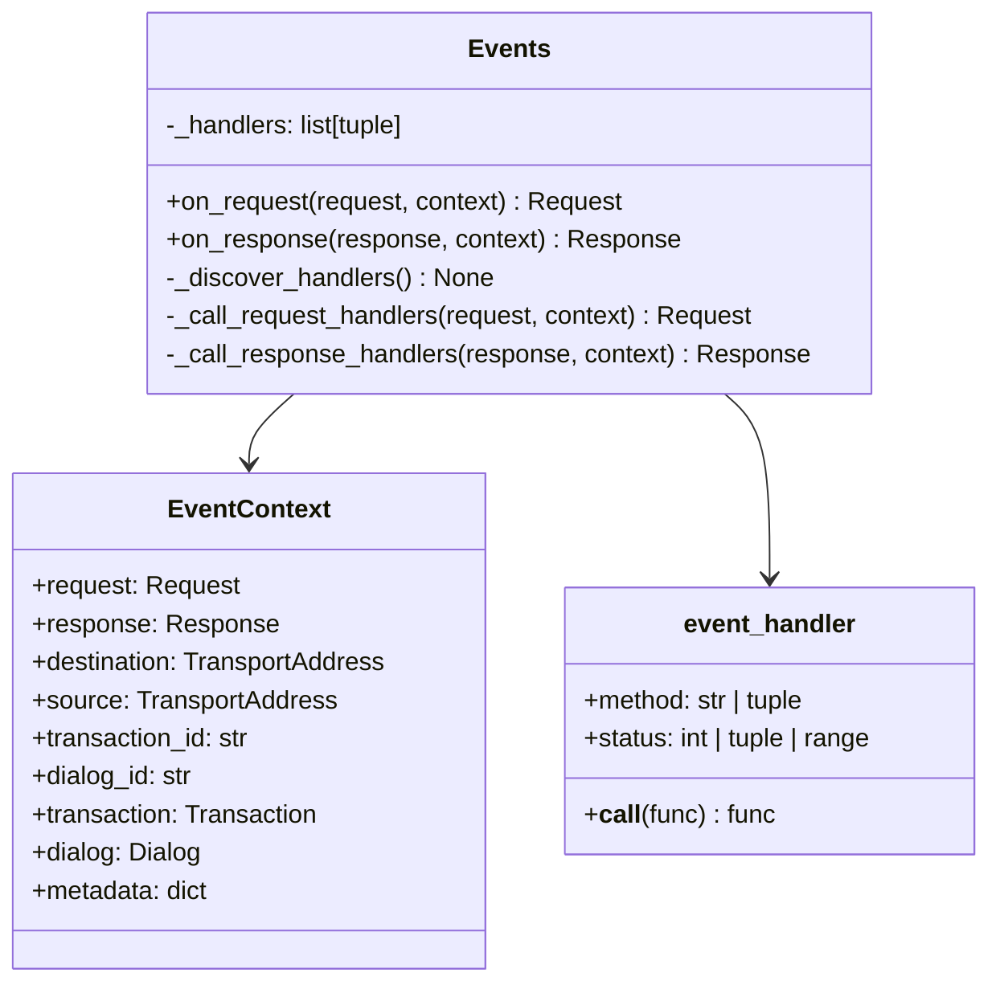

**Padrão declarativo:**
```python
class MyEvents(Events):
    @event_handler('INVITE', status=200)
    def on_call_accepted(self, request, response, context):
        print("Chamada aceita!")

    @event_handler(status=(401, 407))
    def on_auth_required(self, request, response, context):
        print("Auth necessário")

    @event_handler('INVITE', status=183)
    def on_early_media(self, request, response, context):
        if response.body and response.body.has_early_media():
            print("Early media detectado!")
```

### 4.3 Models

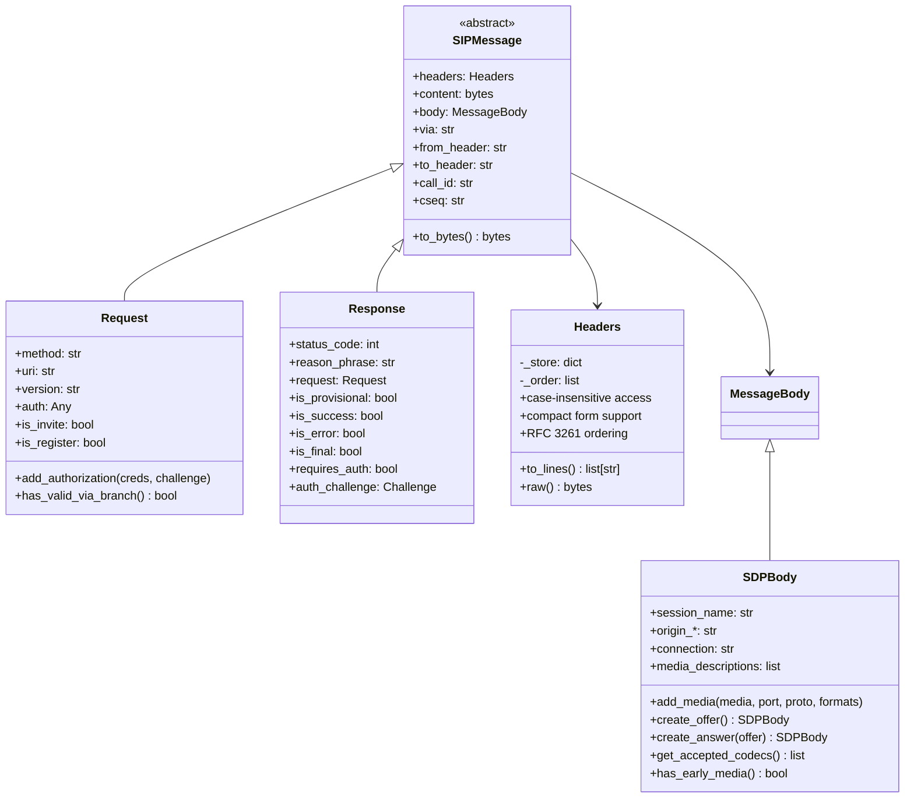

### 4.4 Transport Layer

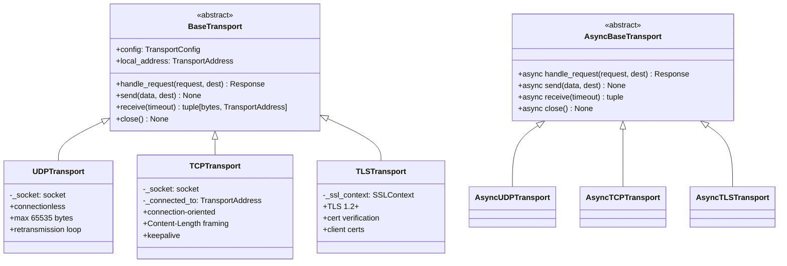

### 4.5 FSM — State Machines (`_fsm.py`)

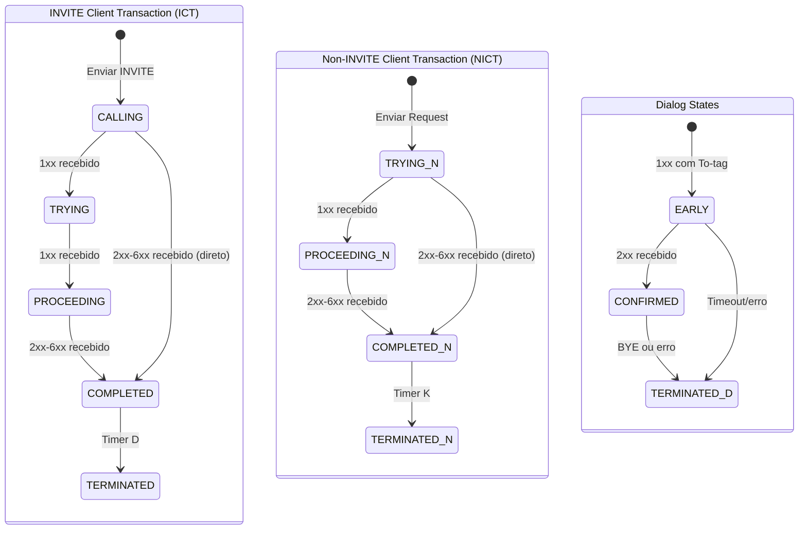

### 4.6 Authentication (`_models/_auth.py`)

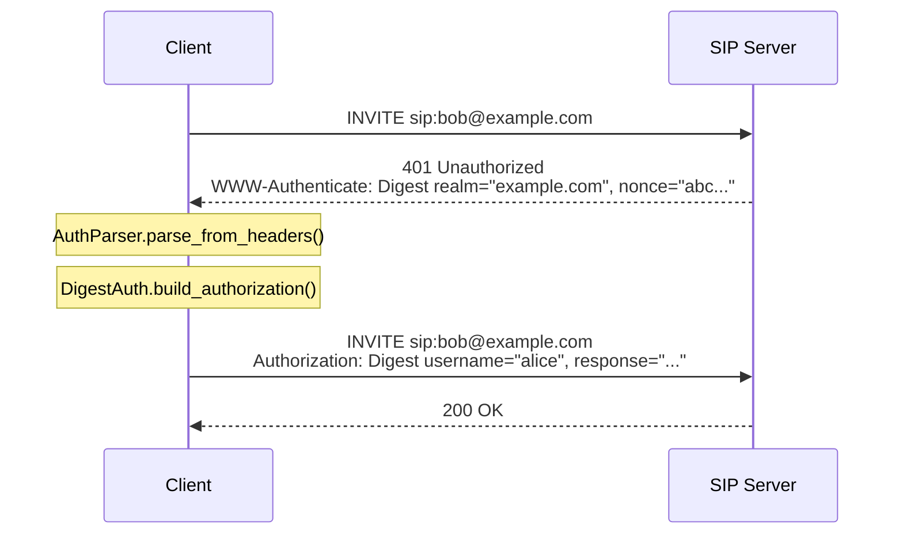

---

## 5. Fluxos Principais

### 5.1 Registro SIP

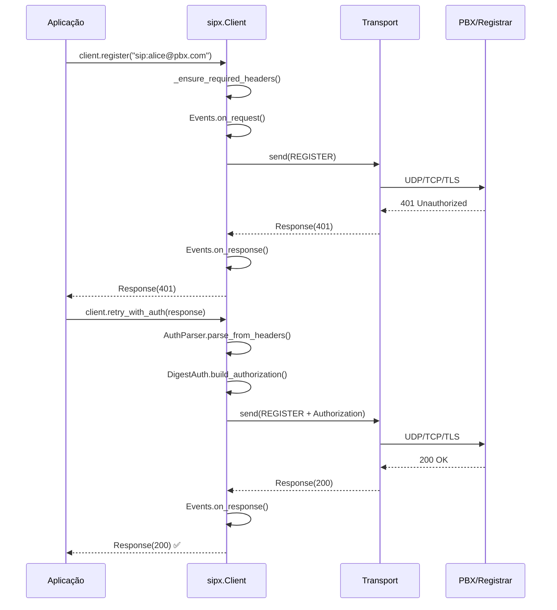

### 5.2 Chamada Completa (INVITE → ACK → BYE)

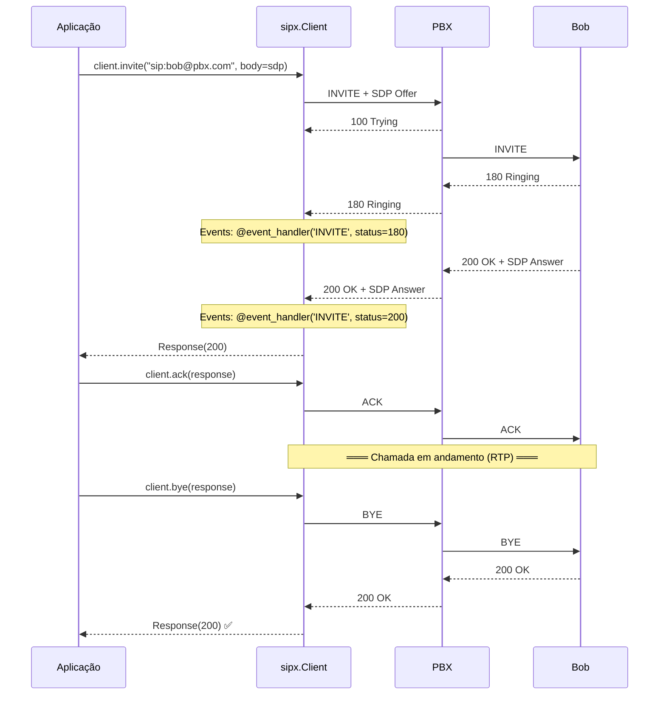

### 5.3 Fluxo de IVR com IA (Planejado)

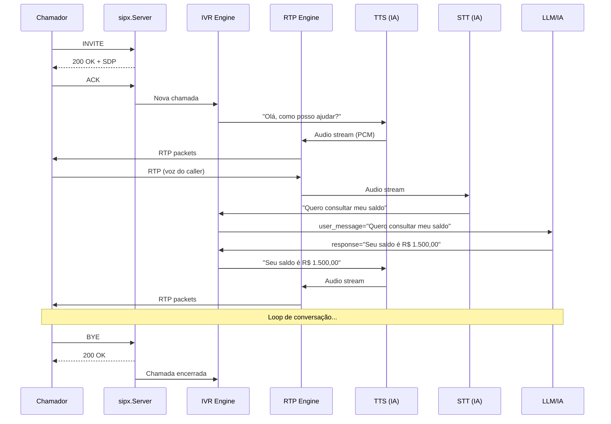

### 5.4 DTMF (Planejado)


---

## 6. Requisitos Levantados

### 6.1 Requisitos Funcionais

#### 6.1.1 Sinalização SIP (Core)

| ID | Requisito | Status | Módulo |
|----|-----------|--------|--------|
| RF-01 | Enviar/receber todos os métodos SIP (INVITE, REGISTER, BYE, ACK, CANCEL, OPTIONS, MESSAGE, SUBSCRIBE, NOTIFY, REFER, INFO, UPDATE, PRACK, PUBLISH) | ✅ Implementado | `_client.py` |
| RF-02 | Parsing completo de mensagens SIP (Request + Response) | ✅ Implementado | `_models/_message.py` |
| RF-03 | Headers case-insensitive com compact forms | ✅ Implementado | `_models/_header.py` |
| RF-04 | Autenticação Digest (MD5, SHA-256) | ✅ Implementado | `_models/_auth.py` |
| RF-05 | SDP Offer/Answer model | ✅ Implementado | `_models/_body.py` |
| RF-06 | Transaction FSM (ICT, NICT) | ✅ Implementado | `_fsm.py` |
| RF-07 | Dialog state management | ✅ Implementado | `_fsm.py` |
| RF-08 | Sistema de eventos declarativo | ✅ Implementado | `_events.py` |
| RF-09 | SIP Server (listener) | ✅ Implementado | `_server.py` |
| RF-10 | Transports UDP, TCP, TLS (sync + async) | ✅ Implementado | `_transports/` |
| RF-11 | Auto re-registration | ✅ Implementado | `_client.py` |
| RF-12 | Context manager (with/async with) | ✅ Implementado | `_client.py` |

#### 6.1.2 Sinalização SIP (Pendente)

| ID | Requisito | Status | Prioridade |
|----|-----------|--------|------------|
| RF-13 | Server-side FSMs (IST, NIST) | ❌ | Alta |
| RF-14 | DNS SRV resolution (RFC 3263) | ❌ | Alta |
| RF-15 | Route/Record-Route processing | ❌ | Alta |
| RF-16 | Forking (múltiplas respostas) | ❌ | Média |
| RF-17 | SIP over WebSocket (RFC 7118) | ❌ | Média |
| RF-18 | IPv6 support | ❌ | Média |
| RF-19 | SCTP transport | ❌ | Baixa |
| RF-20 | Retransmission automática (Timer A/E) | ❌ | Alta |
| RF-21 | 100rel / PRACK completo | ⚠️ Stub | Média |
| RF-22 | Session Timers (RFC 4028) | ❌ | Média |
| RF-23 | SIP URI parser completo (RFC 3986) | ⚠️ Parcial | Alta |

#### 6.1.3 Media / RTP

| ID | Requisito | Status | Prioridade |
|----|-----------|--------|------------|
| RF-30 | RTP send/receive (RFC 3550) | ❌ | 🔴 CRÍTICA |
| RF-31 | DTMF via RTP telephone-event (RFC 4733) | ❌ | 🔴 CRÍTICA |
| RF-32 | DTMF via SIP INFO | ⚠️ Stub (`client.info()`) | Alta |
| RF-33 | Codecs G.711 PCMU/PCMA | ❌ | 🔴 CRÍTICA |
| RF-34 | Codec Opus | ❌ | Alta |
| RF-35 | SRTP (RFC 3711) | ❌ | Alta |
| RF-36 | Media negotiation completa | ⚠️ SDP ok, RTP não | Alta |
| RF-37 | Hold/Resume (a=sendonly/recvonly) | ⚠️ SDP ok | Média |
| RF-38 | Early media (183 Session Progress) | ⚠️ Detecção ok | Média |

#### 6.1.4 Automação / IA

| ID | Requisito | Status | Prioridade |
|----|-----------|--------|------------|
| RF-40 | TTS adapter (text-to-speech → RTP) | ❌ | Alta |
| RF-41 | STT adapter (RTP → speech-to-text) | ❌ | Alta |
| RF-42 | IVR builder (menu, prompts, coleta DTMF) | ❌ | Alta |
| RF-43 | Audio file playback (WAV/PCM → RTP) | ❌ | Alta |
| RF-44 | Audio recording (RTP → WAV/PCM) | ❌ | Média |
| RF-45 | Conferencing (mixer) | ❌ | Baixa |

#### 6.1.5 SIP-I / Brasil

| ID | Requisito | Status | Prioridade |
|----|-----------|--------|------------|
| RF-50 | P-Asserted-Identity | ⚠️ Header definido | Média |
| RF-51 | P-Charging-Vector | ⚠️ Header definido | Média |
| RF-52 | ISUP body encapsulation | ❌ | Média |
| RF-53 | Cause mapping SIP↔ISUP | ❌ | Média |

### 6.2 Requisitos Não-Funcionais

| ID | Requisito | Status |
|----|-----------|--------|
| RNF-01 | Python 3.13+ | ✅ |
| RNF-02 | Zero dependências pesadas (core) | ✅ (apenas `rich`) |
| RNF-03 | Sync e async com mesma API | ✅ |
| RNF-04 | Type hints em 100% do código | ✅ |
| RNF-05 | Documentação com docstrings | ✅ |
| RNF-06 | Lazy parsing (body, auth challenge) | ✅ |
| RNF-07 | Testes unitários com >80% coverage | ❌ (sem testes) |
| RNF-08 | CI/CD (GitHub Actions) | ❌ |
| RNF-09 | PyPI publicável | ⚠️ (setuptools ok, não publicado) |
| RNF-10 | ABC-based extensibility | ✅ |

---

## 7. Inventário — O que foi feito vs O que falta

### 7.1 Resumo Visual

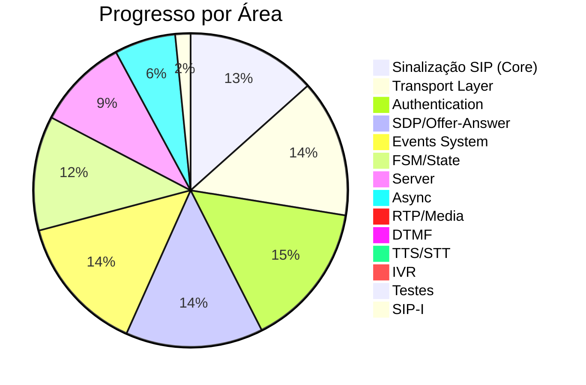

### 7.2 Detalhamento por Módulo

#### ✅ COMPLETO (>80%)

| Módulo | LOC | Status | Notas |
|--------|-----|--------|-------|
| `_models/_auth.py` | 799 | 95% | Digest MD5/SHA-256, challenge parsing, nonce count, qop |
| `_models/_header.py` | 536 | 95% | Case-insensitive, compact forms, RFC ordering |
| `_models/_message.py` | 914 | 90% | Request, Response, MessageParser, URI parser |
| `_models/_body.py` | 922 | 90% | SDPBody completo, Offer/Answer, media info |
| `_events.py` | 336 | 90% | Decorator pattern, method/status filtering |
| `_transports/_udp.py` | 435 | 90% | Sync + Async, timeout, buffer |
| `_transports/_tcp.py` | 570 | 85% | Content-Length framing, connection pooling |
| `_transports/_tls.py` | 675 | 85% | TLS 1.2+, cert verification, async |
| `_transports/_base.py` | 236 | 95% | ABCs sync + async |
| `_client.py` | ~950 | 85% | 14 SIP methods, auth retry, auto-reregister |
| `_utils.py` | 187 | 95% | 50+ headers, 16 compact forms, 60+ reason phrases |
| `_types.py` | 272 | 90% | Enums, dataclasses, exceptions, type aliases |

#### ⚠️ PARCIAL (30-80%)

| Módulo | LOC | Status | O que falta |
|--------|-----|--------|-------------|
| `_fsm.py` | 670 | 70% | IST/NIST (server FSMs), retransmission timers ativos, timer tasks |
| `_server.py` | 310 | 55% | Apenas UDP, sem FSM, sem routing, async é wrapper sync |
| `AsyncClient` | ~400 | 40% | Wrapper sobre sync Client com threading, não é async nativo |
| `BodyParser` | — | 50% | Só SDP; multipart, PIDF, ISUP precisam implementar |

#### ❌ NÃO IMPLEMENTADO (0%)

| Módulo | Descrição | Dependência |
|--------|-----------|-------------|
| `_media/_rtp.py` | RTP engine (send/receive packets) | Nenhuma |
| `_media/_dtmf.py` | DTMF via RTP (RFC 4733) + SIP INFO | RTP engine |
| `_media/_codecs.py` | G.711, Opus encode/decode | Nenhuma |
| `_media/_tts.py` | Text-to-Speech adapter | RTP + codecs |
| `_media/_stt.py` | Speech-to-Text adapter | RTP + codecs |
| `_srtp/_srtp.py` | SRTP encryption | RTP engine |
| `_contrib/_ivr.py` | IVR builder | RTP + DTMF + TTS |
| `_contrib/_fastapi.py` | FastAPI integration | Core |
| `_contrib/_cli.py` | CLI tools | Core |
| `_transports/_ws.py` | WebSocket transport | Core |
| Testes | pytest suite | Todos |
| CI/CD | GitHub Actions | Nenhuma |

---

## 8. API Design (Estilo httpx)

### 8.1 Comparação httpx vs sipx

```python
# ═══════════════════════════════════════
# httpx
# ═══════════════════════════════════════
import httpx

# Sync
response = httpx.get("https://example.com")
with httpx.Client() as client:
    r = client.post("/api", json={"key": "val"})

# Async
async with httpx.AsyncClient() as client:
    r = await client.get("https://example.com")


# ═══════════════════════════════════════
# sipx (atual)
# ═══════════════════════════════════════
import sipx

# Sync
with sipx.Client() as client:
    client.auth = sipx.Auth.Digest("alice", "secret")
    r = client.register("sip:alice@pbx.com")
    r = client.invite("sip:bob@pbx.com", body=sdp)

# Async
async with sipx.AsyncClient() as client:
    r = await client.register("sip:alice@pbx.com")


# ═══════════════════════════════════════
# sipx (visão futura com media)
# ═══════════════════════════════════════
from sipx import Client, Auth, Events, event_handler, SDPBody
from sipx.media import RTPSession, DTMFCollector
from sipx.contrib.ivr import IVR, Menu, Prompt
from sipx.contrib.tts import GoogleTTS  # ou ElevenLabsTTS, etc.
from sipx.contrib.stt import WhisperSTT

class CallHandler(Events):
    @event_handler('INVITE', status=200)
    def on_call(self, request, response, context):
        rtp = RTPSession.from_sdp(response.body)

        # TTS
        tts = GoogleTTS(language="pt-BR")
        rtp.play(tts.synthesize("Olá! Pressione 1 para vendas."))

        # DTMF collect
        dtmf = DTMFCollector(rtp, max_digits=1, timeout=10)
        digit = dtmf.collect()

        # STT
        stt = WhisperSTT()
        rtp.play(tts.synthesize("Diga seu nome após o bip."))
        text = stt.transcribe(rtp.record(max_duration=10))

        print(f"Usuário disse: {text}")
```

### 8.2 API Surface Planejada

```python
# ═══ Top-level exports (sipx/) ═══
sipx.Client            # Sync SIP client
sipx.AsyncClient       # Async SIP client
sipx.Events            # Event handler base class
sipx.event_handler     # Decorator
sipx.Auth              # Auth factory (Auth.Digest, Auth.Basic)
sipx.Request           # SIP Request
sipx.Response          # SIP Response
sipx.SDPBody           # SDP body
sipx.Headers           # SIP headers

# ═══ Media (sipx.media/) ═══
sipx.media.RTPSession      # RTP send/receive
sipx.media.DTMFSender      # Send DTMF digits
sipx.media.DTMFCollector   # Collect DTMF digits
sipx.media.AudioPlayer     # Play WAV/PCM files
sipx.media.AudioRecorder   # Record to WAV/PCM
sipx.media.Codec           # Codec negotiation

# ═══ Contrib (sipx.contrib/) ═══
sipx.contrib.IVR           # IVR builder
sipx.contrib.Menu          # IVR menu
sipx.contrib.Prompt        # IVR prompt
sipx.contrib.tts.*         # TTS adapters
sipx.contrib.stt.*         # STT adapters
sipx.contrib.fastapi.*     # FastAPI integration
```

---

## 9. Roadmap de Implementação

### Fase 1 — Consolidação do Core (Prioridade: 🔴 CRÍTICA)

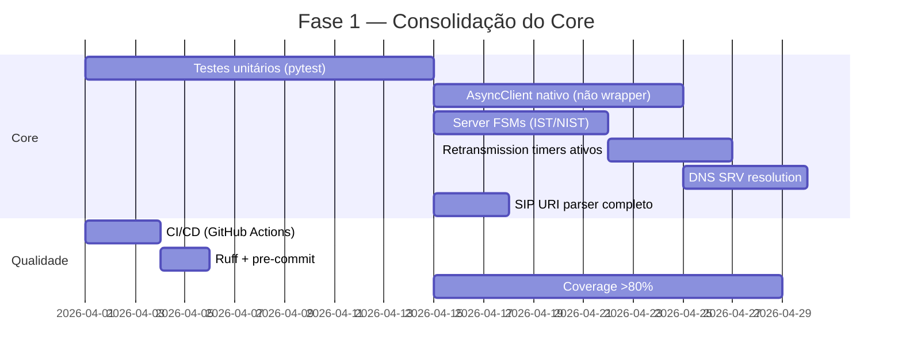

### Fase 2 — Media Layer (Prioridade: 🔴 CRÍTICA)

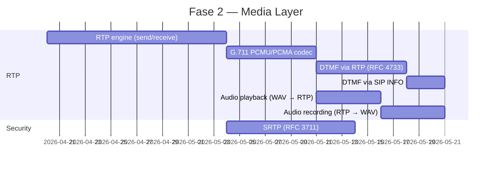

### Fase 3 — Automação / IA (Prioridade: 🟡 ALTA)

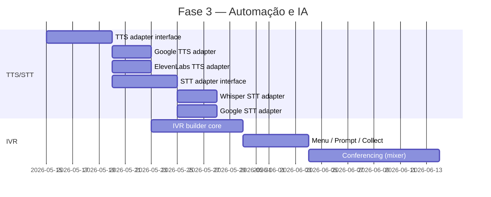

### Fase 4 — Extensões (Prioridade: 🟢 MÉDIA)


---

## 10. Padrões de Design

### 10.1 Padrões Utilizados

| Padrão | Onde | Descrição |
|--------|------|-----------|
| **Strategy** | Transports | `BaseTransport` → UDP/TCP/TLS plugáveis |
| **Observer** | Events | `@event_handler` + `Events._call_*_handlers()` |
| **State Machine** | FSM | `Transaction.transition_to()`, `Dialog.transition_to()` |
| **Factory** | Auth | `Auth.Digest()` retorna `SipAuthCredentials` |
| **Template Method** | SIPMessage ABC | `to_bytes()`, `content`, `headers` |
| **Lazy Initialization** | Body parsing | `response.body` faz parse na primeira chamada |
| **Context Manager** | Client/Server | `with Client() as c:` / `async with AsyncClient()` |
| **Decorator** | event_handler | `@event_handler('INVITE', status=200)` |
| **Builder** | SDPBody | `SDPBody.create_offer()`, `.add_media()` |

### 10.2 Princípios

1. **Explícito > Implícito** — Autenticação é manual (`retry_with_auth()`), não automática
2. **Lazy por padrão** — Bodies são parsed sob demanda
3. **Extensível via ABCs** — Todos os componentes principais têm abstract base classes
4. **Compatível com httpx** — API surface familiar para Pythonistas
5. **Batteries included** — Constants, reason phrases, compact forms incluídos

---

## 11. Dependências

### 11.1 Atuais

| Pacote | Versão | Uso | Obrigatória |
|--------|--------|-----|-------------|
| `rich` | >=14.1.0 | Console output, logging | Sim (considerar tornar opcional) |
| `typer` | >=0.17.4 | CLI framework | Não (contrib) |
| `textual` | >=6.1.0 | TUI framework | Não (contrib) |

### 11.2 Planejadas

| Pacote | Uso | Obrigatória |
|--------|-----|-------------|
| `anyio` ou `asyncio` | Async nativo | Sim (stdlib) |
| `cryptography` | SRTP | Não (media) |
| `numpy` | Audio processing | Não (media) |
| `google-cloud-speech` | TTS/STT | Não (contrib) |
| `openai-whisper` | STT local | Não (contrib) |
| `websockets` | WebSocket transport | Não (transport) |

---

## 12. Testes (Planejado)

```
tests/
├── conftest.py                    # Fixtures (mock transport, PBX)
├── test_client.py                 # Client methods
├── test_async_client.py           # AsyncClient
├── test_events.py                 # Event system
├── test_fsm.py                    # Transaction/Dialog states
├── test_server.py                 # SIPServer
├── models/
│   ├── test_message.py            # Request/Response/Parser
│   ├── test_header.py             # Headers case-insensitivity
│   ├── test_body.py               # SDPBody, Offer/Answer
│   └── test_auth.py               # Digest auth, challenge parsing
├── transports/
│   ├── test_udp.py                # UDP transport
│   ├── test_tcp.py                # TCP transport
│   └── test_tls.py                # TLS transport
├── media/                         # (futuro)
│   ├── test_rtp.py
│   ├── test_dtmf.py
│   └── test_codecs.py
└── integration/
    ├── test_asterisk.py           # Testes com Asterisk Docker
    └── test_e2e.py                # End-to-end flows
```

---

## 13. Glossário

| Termo | Definição |
|-------|-----------|
| **SIP** | Session Initiation Protocol — protocolo de sinalização para VoIP |
| **SDP** | Session Description Protocol — descreve parâmetros de mídia |
| **RTP** | Real-time Transport Protocol — transporte de mídia em tempo real |
| **SRTP** | Secure RTP — RTP com criptografia |
| **DTMF** | Dual-Tone Multi-Frequency — tons de discagem |
| **IVR** | Interactive Voice Response — URA (Unidade de Resposta Audível) |
| **TTS** | Text-to-Speech — síntese de voz |
| **STT** | Speech-to-Text — reconhecimento de voz |
| **UAC** | User Agent Client — quem inicia a requisição SIP |
| **UAS** | User Agent Server — quem recebe a requisição SIP |
| **ICT** | INVITE Client Transaction |
| **NICT** | Non-INVITE Client Transaction |
| **IST** | INVITE Server Transaction |
| **NIST** | Non-INVITE Server Transaction |
| **SIP-I** | SIP with encapsulated ISUP |
| **ISUP** | ISDN User Part — protocolo de sinalização telefônica |
| **PBX** | Private Branch Exchange — central telefônica |

---

## Apêndice A — Métodos SIP Implementados

| Método | RFC | `Client` | `AsyncClient` | Descrição |
|--------|-----|----------|----------------|-----------|
| INVITE | 3261 | ✅ | ✅ | Iniciar chamada |
| ACK | 3261 | ✅ | ✅ | Confirmar INVITE |
| BYE | 3261 | ✅ | ✅ | Encerrar chamada |
| CANCEL | 3261 | ✅ | ✅ | Cancelar INVITE pendente |
| REGISTER | 3261 | ✅ | ✅ | Registrar localização |
| OPTIONS | 3261 | ✅ | ✅ | Consultar capacidades |
| MESSAGE | 3428 | ✅ | ✅ | Mensagem instantânea |
| SUBSCRIBE | 3265 | ✅ (stub) | ✅ (stub) | Inscrever-se em eventos |
| NOTIFY | 3265 | ✅ (stub) | ✅ (stub) | Notificar evento |
| REFER | 3515 | ✅ (stub) | ✅ (stub) | Transferência de chamada |
| INFO | 2976 | ✅ | ✅ | Informação mid-dialog (DTMF) |
| UPDATE | 3311 | ✅ (stub) | ✅ (stub) | Atualizar sessão |
| PRACK | 3262 | ✅ (stub) | ✅ (stub) | ACK provisório (100rel) |
| PUBLISH | 3903 | ✅ (stub) | ✅ (stub) | Publicar estado |

## Apêndice B — Status Codes Suportados

Todos os 60+ status codes SIP são definidos em `_utils.py:REASON_PHRASES`:
- **1xx** Provisional: 100, 180, 181, 182, 183
- **2xx** Success: 200, 202
- **3xx** Redirection: 300, 301, 302, 305, 380
- **4xx** Client Error: 400-493 (21 códigos)
- **5xx** Server Error: 500-513 (6 códigos)
- **6xx** Global Failure: 600, 603, 604, 606
