# sipx - Software Design Document (SDD)

> **Version:** 0.1.0
> **Date:** 2026-03-30
> **Status:** In development (v0.3.0)
> **Main inspiration:** [httpx](https://www.python-httpx.org/) — Pythonic API, sync/async, extensible
> **Implementation references:** [sipd](https://github.com/initbar/sipd), [sipmessage](https://github.com/spacinov/sipmessage), [sip-parser](https://github.com/alxgb/sip-parser), [PySipIvr](https://github.com/ersansrck/PySipIvr), [sip-resources](https://github.com/miconda/sip-resources)
> **Other inspirations:** [pyVoIP](https://github.com/tayler6000/pyVoIP), [aiosip](https://github.com/Eyepea/aiosip), [pysipp](https://github.com/SIPp/pysipp), [PySIPio](https://pypi.org/project/PySIPio/), [b2bua](https://github.com/sippy/b2bua), [katariSIP](https://github.com/klocation/katarisip), [SIP-Auth-helper](https://github.com/pbertera/SIP-Auth-helper), [callsip.py](https://github.com/rundekugel/callsip.py)
> **Python:** 3.13+
> **License:** MIT

---

## 1. Overview

**sipx** is a SIP (Session Initiation Protocol) library for Python, inspired by httpx, designed to be **simple, high-performance, and extensible**. It enables creating everything from VoIP automation scripts to complete systems with IVR, TTS, STT, and AI integration.

### 1.1 Goals

| Goal                       | Description                                                                       |
| -------------------------- | --------------------------------------------------------------------------------- |
| **Simplicity**             | Clean and intuitive API inspired by httpx (`client.invite()`, `client.register()`) |
| **Sync + Async**           | `Client` and `AsyncClient` with the same API                                      |
| **Declarative events**     | `@event_handler('INVITE', status=200)` as decorators                               |
| **High performance**       | Zero-copy parsing, lazy body parsing, connection pooling                           |
| **RFC Compliance**         | RFC 3261, 2617, 7616, 4566, 3264, 4733 and Brazilian extensions                   |
| **Extensibility**          | Pluggable transports, body parsers, auth methods via ABCs                          |
| **Multi-platform**         | CLI, FastAPI, TUI (Textual), automation scripts                                    |
| **Voice automation**       | IVR, TTS, STT, DTMF, RTP support for AI integration                               |

### 1.2 Target Audience

- Developers building VoIP/SIP automations
- AI-powered IVR systems (TTS/STT)
- CLI tools for SIP testing and diagnostics
- FastAPI applications with SIP signaling
- TUIs for call monitoring

---

## 2. Architecture

### 2.1 Layer Diagram


> Red = Not implemented

### 2.2 Package Structure

```text
sipx/
├── __init__.py          # Public API exports
├── _client.py           # Client + AsyncClient (high level)
├── _server.py           # SIPServer + AsyncSIPServer
├── _events.py           # Events + @event_handler decorator
├── _fsm.py              # Transaction + Dialog + StateManager
├── _types.py            # Enums, DataClasses, Exceptions, Type Aliases
├── _utils.py            # Constants (EOL, HEADERS, REASON_PHRASES), logging
├── main.py              # Entry point (empty)
│
├── _models/
│   ├── __init__.py      # Re-exports
│   ├── _message.py      # SIPMessage (ABC), Request, Response, MessageParser
│   ├── _header.py       # HeaderContainer (ABC), Headers, HeaderParser
│   ├── _body.py         # MessageBody (ABC), SDPBody, BodyParser
│   └── _auth.py         # Auth, DigestAuth, DigestChallenge, AuthParser
│
├── _transports/
│   ├── __init__.py      # Lazy loading
│   ├── _base.py         # BaseTransport (ABC), AsyncBaseTransport (ABC)
│   ├── _udp.py          # UDPTransport, AsyncUDPTransport
│   ├── _tcp.py          # TCPTransport, AsyncTCPTransport
│   └── _tls.py          # TLSTransport, AsyncTLSTransport
│
├── _media/              # ❌ PLANNED
│   ├── __init__.py
│   ├── _rtp.py          # RTP send/receive (RFC 3550)
│   ├── _dtmf.py         # DTMF RFC 4733 + RFC 2833 + SIP INFO
│   ├── _codecs.py       # G.711 (PCMU/PCMA), Opus, etc.
│   ├── _tts.py          # Text-to-Speech adapter
│   └── _stt.py          # Speech-to-Text adapter
│
├── _srtp/               # ❌ PLANNED
│   └── _srtp.py         # SRTP (RFC 3711)
│
└── _contrib/            # ❌ PLANNED
    ├── _ivr.py          # IVR builder
    ├── _fastapi.py      # FastAPI integration
    └── _cli.py          # CLI tools
```

---

## 3. RFC Compliance

### 3.1 Implemented RFCs

| RFC      | Title                             | Module                                  | Status               |
| -------- | --------------------------------- | --------------------------------------- | -------------------- |
| **3261** | SIP: Session Initiation Protocol  | `_client`, `_models`, `_fsm`, `_server` | ✅ Core implemented  |
| **2617** | HTTP Digest Authentication        | `_models/_auth.py`                      | ✅ Complete          |
| **7616** | HTTP Digest (SHA-256)             | `_models/_auth.py`                      | ✅ Complete          |
| **8760** | Digest Algorithm Comparison       | `_models/_auth.py`                      | ⚠️ Partial           |
| **4566** | SDP: Session Description Protocol | `_models/_body.py`                      | ✅ Complete          |
| **3264** | Offer/Answer Model with SDP       | `_models/_body.py`                      | ✅ Complete          |
| **3581** | Symmetric Response (rport)        | `_client.py` (Via header)               | ⚠️ Partial           |

### 3.2 Required RFCs (Not Implemented)

| RFC      | Title                             | Priority   | Planned Module                |
| -------- | --------------------------------- | ---------- | ----------------------------- |
| **3550** | RTP: Real-time Transport Protocol | CRITICAL   | `_media/_rtp.py`              |
| **3551** | RTP/AVP Profile                   | CRITICAL   | `_media/_codecs.py`           |
| **4733** | DTMF via RTP (telephone-event)    | CRITICAL   | `_media/_dtmf.py`             |
| **2833** | DTMF via RTP (legacy)             | HIGH       | `_media/_dtmf.py`             |
| **3711** | SRTP: Secure RTP                  | HIGH       | `_srtp/_srtp.py`              |
| **3263** | SIP: DNS/SRV Locating             | HIGH       | `_client.py`                  |
| **3327** | SIP: Path Header                  | HIGH       | `_models/_header.py`          |
| **3515** | SIP: REFER Method                 | HIGH       | `_client.py` (stub exists)    |
| **3265** | SIP: SUBSCRIBE/NOTIFY             | HIGH       | `_client.py` (stub exists)    |
| **3262** | SIP: PRACK (100rel)               | MEDIUM     | `_client.py` (stub exists)    |
| **3311** | SIP: UPDATE Method                | MEDIUM     | `_client.py` (stub exists)    |
| **3428** | SIP: MESSAGE Method               | MEDIUM     | `_client.py` (implemented)    |
| **3903** | SIP: PUBLISH Method               | MEDIUM     | `_client.py` (stub exists)    |
| **3323** | SIP: Privacy Mechanism            | MEDIUM     | `_models/_header.py`          |
| **3325** | P-Asserted-Identity               | MEDIUM     | `_utils.py` (header defined)  |
| **7118** | SIP over WebSocket                | MEDIUM     | `_transports/_ws.py`          |
| **6665** | SIP: Event Framework              | MEDIUM     | `_events.py`                  |
| **5765** | SIP-I (ISUP interworking)         | MEDIUM     | `_contrib/_sipi.py`           |

### 3.3 SIP-I (Brazil/International Interworking)

| Spec            | Title                                    | Status                              |
| --------------- | ---------------------------------------- | ----------------------------------- |
| ITU-T Q.1912.5  | SIP-I: ISUP/SIP Interworking            | ❌ Not implemented                  |
| ANATEL Res. 717 | Brazilian VoIP Regulation                | ❌ Not implemented                  |
| SIP-I Headers   | P-Charging-Vector, P-Access-Network-Info | ⚠️ Headers defined in `_utils.py`   |

---

## 4. Detailed Components

### 4.1 Client (`_client.py`)

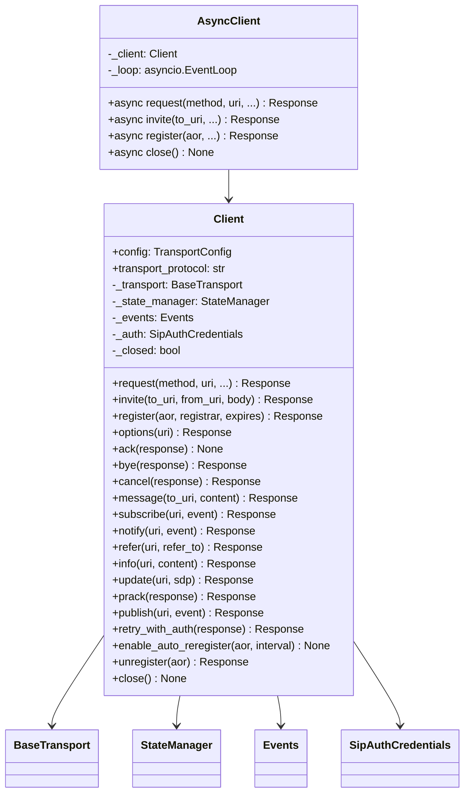

**API inspired by httpx:**

```python
# httpx style
response = httpx.get("https://example.com")

# sipx style
response = client.invite("sip:bob@example.com")
response = client.register("sip:alice@pbx.com")
```

### 4.2 Events System (`_events.py`)

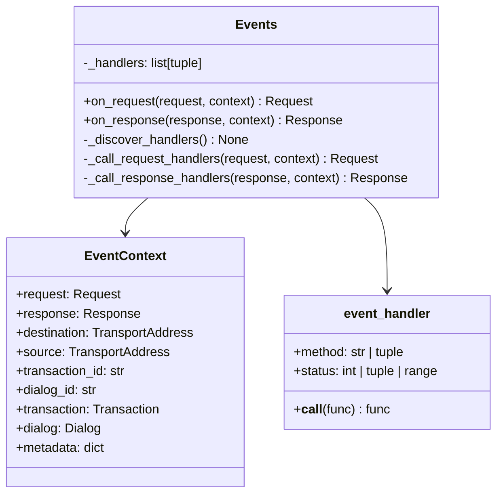

**Declarative pattern:**

```python
class MyEvents(Events):
    @event_handler('INVITE', status=200)
    def on_call_accepted(self, request, response, context):
        print("Call accepted!")

    @event_handler(status=(401, 407))
    def on_auth_required(self, request, response, context):
        print("Auth required")

    @event_handler('INVITE', status=183)
    def on_early_media(self, request, response, context):
        if response.body and response.body.has_early_media():
            print("Early media detected!")
```

### 4.3 Models

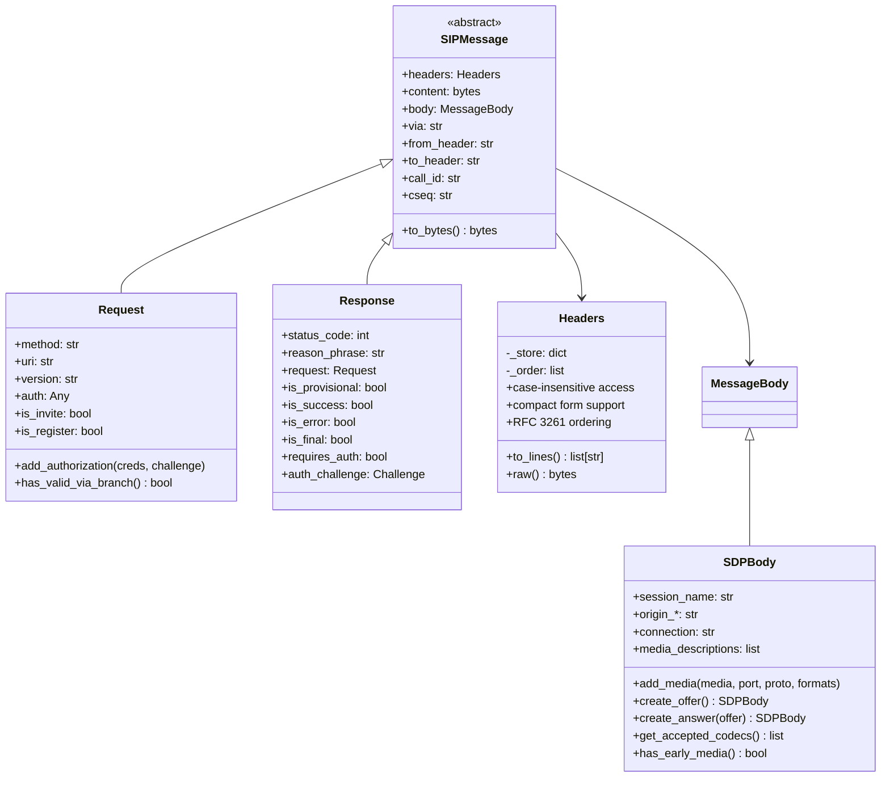

### 4.4 Transport Layer


### 4.5 FSM -- State Machines (`_fsm.py`)

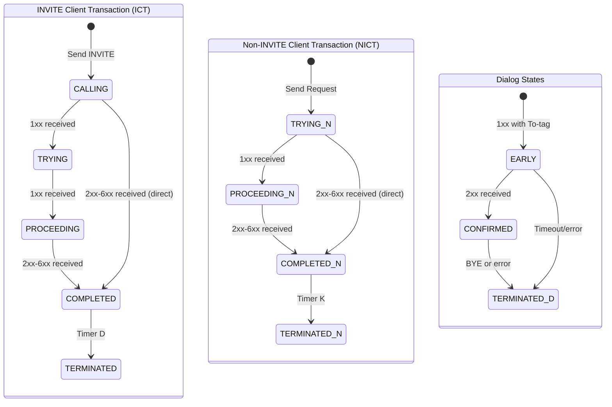

### 4.6 Authentication (`_models/_auth.py`)

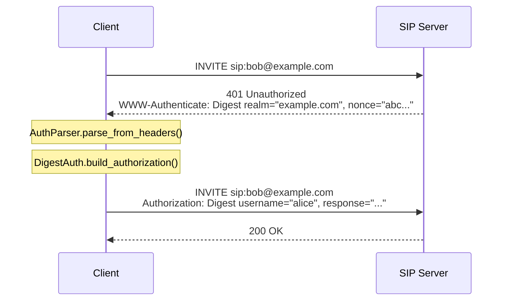

---

## 5. Main Flows

### 5.1 SIP Registration

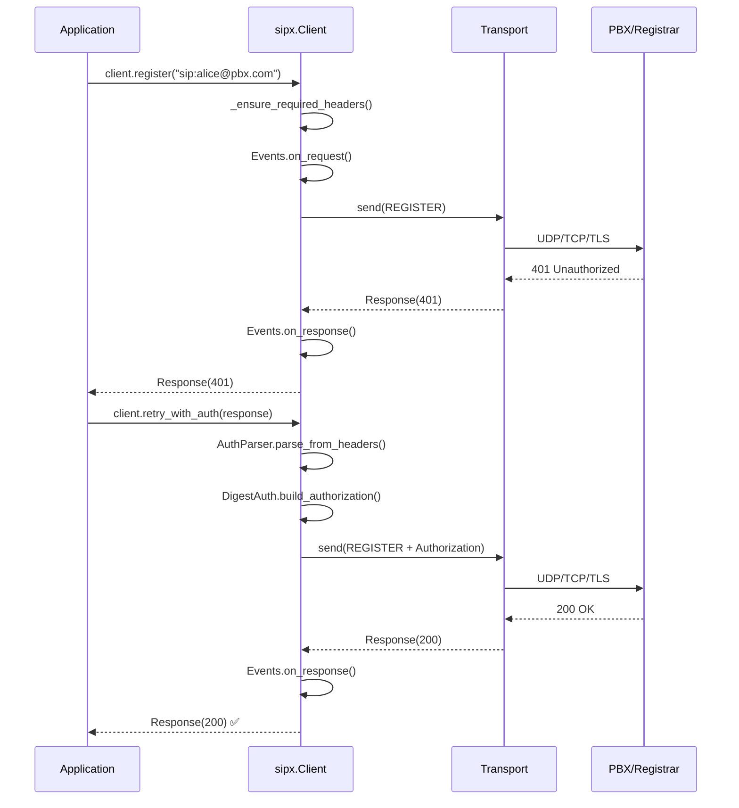

### 5.2 Complete Call (INVITE -> ACK -> BYE)

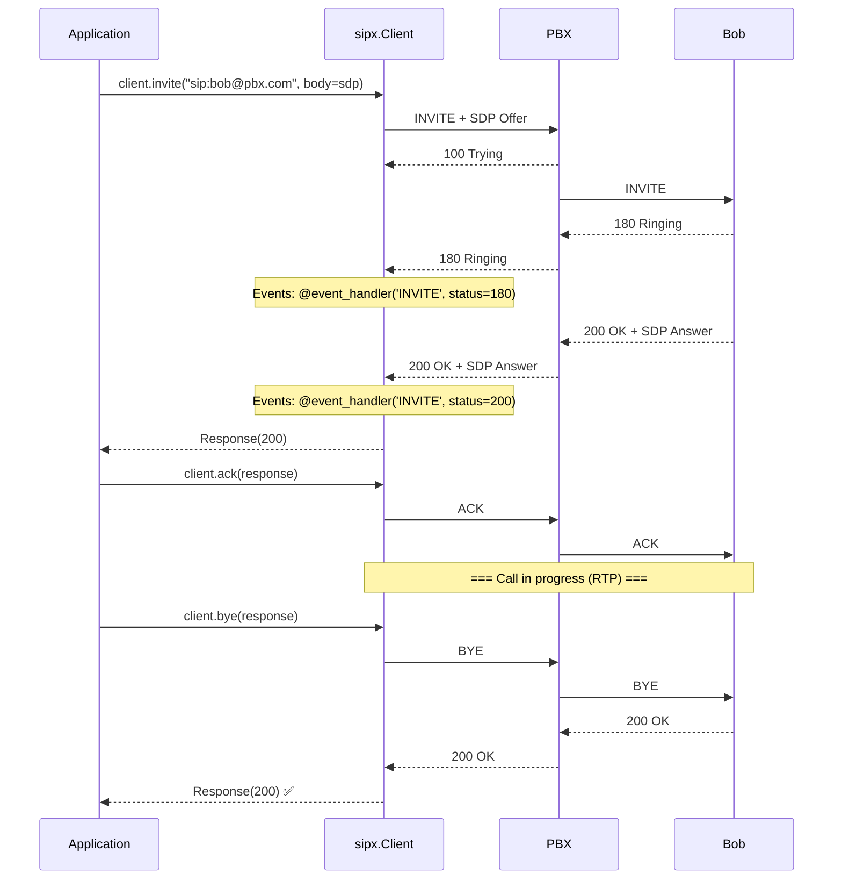

### 5.3 IVR Flow with AI (Planned)

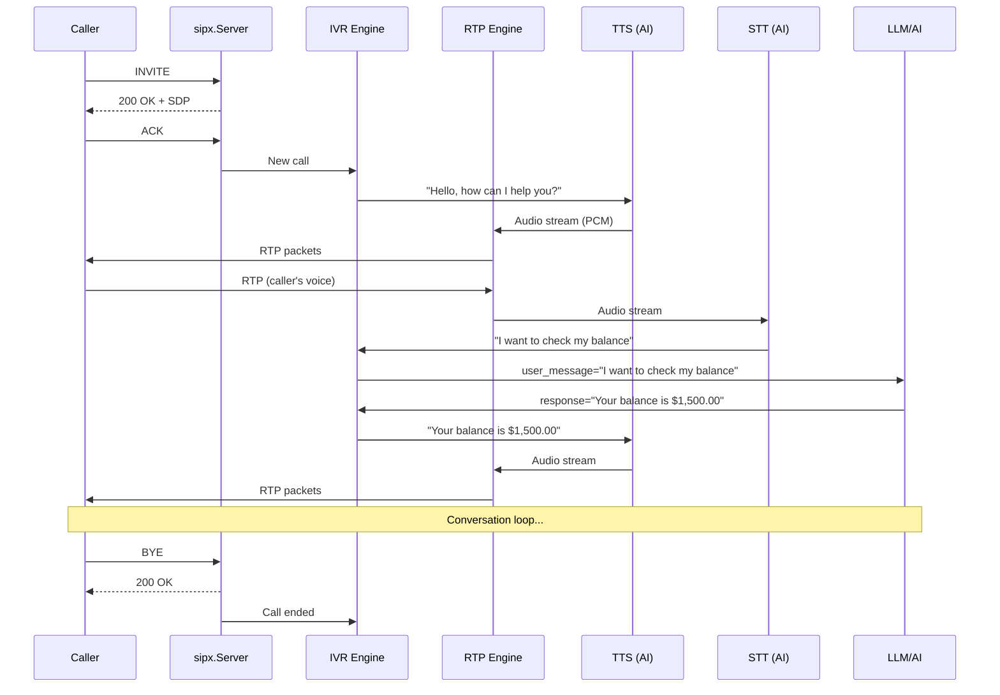

### 5.4 DTMF (Planned)

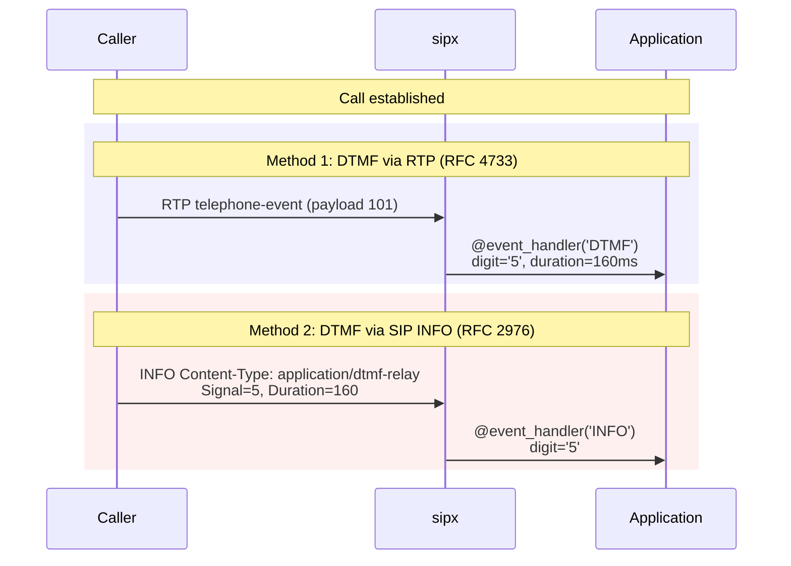

---

## 6. Requirements

### 6.1 Functional Requirements

#### 6.1.1 SIP Signaling (Core)

| ID    | Requirement                                                                                                                                        | Status      | Module                |
| ----- | -------------------------------------------------------------------------------------------------------------------------------------------------- | ----------- | --------------------- |
| RF-01 | Send/receive all SIP methods (INVITE, REGISTER, BYE, ACK, CANCEL, OPTIONS, MESSAGE, SUBSCRIBE, NOTIFY, REFER, INFO, UPDATE, PRACK, PUBLISH)       | ✅ Implemented | `_client.py`          |
| RF-02 | Complete SIP message parsing (Request + Response)                                                                                                  | ✅ Implemented | `_models/_message.py` |
| RF-03 | Case-insensitive headers with compact forms                                                                                                        | ✅ Implemented | `_models/_header.py`  |
| RF-04 | Digest authentication (MD5, SHA-256)                                                                                                               | ✅ Implemented | `_models/_auth.py`    |
| RF-05 | SDP Offer/Answer model                                                                                                                             | ✅ Implemented | `_models/_body.py`    |
| RF-06 | Transaction FSM (ICT, NICT)                                                                                                                        | ✅ Implemented | `_fsm.py`             |
| RF-07 | Dialog state management                                                                                                                            | ✅ Implemented | `_fsm.py`             |
| RF-08 | Declarative event system                                                                                                                           | ✅ Implemented | `_events.py`          |
| RF-09 | SIP Server (listener)                                                                                                                              | ✅ Implemented | `_server.py`          |
| RF-10 | Transports UDP, TCP, TLS (sync + async)                                                                                                            | ✅ Implemented | `_transports/`        |
| RF-11 | Auto re-registration                                                                                                                               | ✅ Implemented | `_client.py`          |
| RF-12 | Context manager (with/async with)                                                                                                                  | ✅ Implemented | `_client.py`          |

#### 6.1.2 SIP Signaling (Pending)

| ID    | Requirement                           | Status     | Priority |
| ----- | ------------------------------------- | ---------- | -------- |
| RF-13 | Server-side FSMs (IST, NIST)         | ❌         | High     |
| RF-14 | DNS SRV resolution (RFC 3263)        | ❌         | High     |
| RF-15 | Route/Record-Route processing        | ❌         | High     |
| RF-16 | Forking (multiple responses)         | ❌         | Medium   |
| RF-17 | SIP over WebSocket (RFC 7118)        | ❌         | Medium   |
| RF-18 | IPv6 support                         | ❌         | Medium   |
| RF-19 | SCTP transport                       | ❌         | Low      |
| RF-20 | Automatic retransmission (Timer A/E) | ❌         | High     |
| RF-21 | 100rel / complete PRACK              | ⚠️ Stub    | Medium   |
| RF-22 | Session Timers (RFC 4028)            | ❌         | Medium   |
| RF-23 | Complete SIP URI parser (RFC 3986)   | ⚠️ Partial | High     |

#### 6.1.3 Media / RTP

| ID    | Requirement                             | Status                    | Priority |
| ----- | --------------------------------------- | ------------------------- | -------- |
| RF-30 | RTP send/receive (RFC 3550)             | ❌                        | CRITICAL |
| RF-31 | DTMF via RTP telephone-event (RFC 4733) | ❌                        | CRITICAL |
| RF-32 | DTMF via SIP INFO                       | ⚠️ Stub (`client.info()`) | High     |
| RF-33 | Codecs G.711 PCMU/PCMA                  | ❌                        | CRITICAL |
| RF-34 | Codec Opus                              | ❌                        | High     |
| RF-35 | SRTP (RFC 3711)                         | ❌                        | High     |
| RF-36 | Complete media negotiation              | ⚠️ SDP ok, RTP no         | High     |
| RF-37 | Hold/Resume (a=sendonly/recvonly)       | ⚠️ SDP ok                 | Medium   |
| RF-38 | Early media (183 Session Progress)      | ⚠️ Detection ok           | Medium   |

#### 6.1.4 Automation / AI

| ID    | Requirement                              | Status | Priority |
| ----- | ---------------------------------------- | ------ | -------- |
| RF-40 | TTS adapter (text-to-speech -> RTP)      | ❌     | High     |
| RF-41 | STT adapter (RTP -> speech-to-text)      | ❌     | High     |
| RF-42 | IVR builder (menu, prompts, DTMF collection) | ❌     | High     |
| RF-43 | Audio file playback (WAV/PCM -> RTP)     | ❌     | High     |
| RF-44 | Audio recording (RTP -> WAV/PCM)         | ❌     | Medium   |
| RF-45 | Conferencing (mixer)                     | ❌     | Low      |

#### 6.1.5 SIP-I / Brazil

| ID    | Requirement             | Status             | Priority |
| ----- | ----------------------- | ------------------ | -------- |
| RF-50 | P-Asserted-Identity     | ⚠️ Header defined  | Medium   |
| RF-51 | P-Charging-Vector       | ⚠️ Header defined  | Medium   |
| RF-52 | ISUP body encapsulation | ❌                 | Medium   |
| RF-53 | Cause mapping SIP<->ISUP | ❌                 | Medium   |

### 6.2 Non-Functional Requirements

| ID     | Requirement                         | Status                              |
| ------ | ----------------------------------- | ----------------------------------- |
| RNF-01 | Python 3.13+                        | ✅                                  |
| RNF-02 | Zero heavy dependencies (core)      | ✅ (only `rich`)                    |
| RNF-03 | Sync and async with the same API    | ✅                                  |
| RNF-04 | Type hints in 100% of the code      | ✅                                  |
| RNF-05 | Documentation with docstrings       | ✅                                  |
| RNF-06 | Lazy parsing (body, auth challenge) | ✅                                  |
| RNF-07 | Unit tests with >80% coverage       | ❌ (no tests)                       |
| RNF-08 | CI/CD (GitHub Actions)              | ❌                                  |
| RNF-09 | PyPI publishable                    | ⚠️ (setuptools ok, not published)   |
| RNF-10 | ABC-based extensibility             | ✅                                  |

---

## 7. Inventory -- What's Done vs What's Missing

### 7.1 Visual Summary

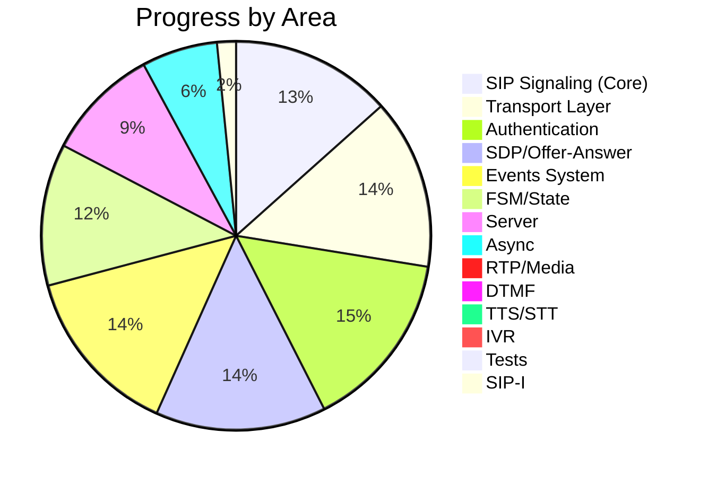

### 7.2 Breakdown by Module

#### COMPLETE (>80%)

| Module                 | LOC  | Status | Notes                                                   |
| ---------------------- | ---- | ------ | ------------------------------------------------------- |
| `_models/_auth.py`     | 799  | 95%    | Digest MD5/SHA-256, challenge parsing, nonce count, qop |
| `_models/_header.py`   | 536  | 95%    | Case-insensitive, compact forms, RFC ordering           |
| `_models/_message.py`  | 914  | 90%    | Request, Response, MessageParser, URI parser            |
| `_models/_body.py`     | 922  | 90%    | Complete SDPBody, Offer/Answer, media info              |
| `_events.py`           | 336  | 90%    | Decorator pattern, method/status filtering              |
| `_transports/_udp.py`  | 435  | 90%    | Sync + Async, timeout, buffer                           |
| `_transports/_tcp.py`  | 570  | 85%    | Content-Length framing, connection pooling              |
| `_transports/_tls.py`  | 675  | 85%    | TLS 1.2+, cert verification, async                      |
| `_transports/_base.py` | 236  | 95%    | ABCs sync + async                                       |
| `_client.py`           | ~950 | 85%    | 14 SIP methods, auth retry, auto-reregister             |
| `_utils.py`            | 187  | 95%    | 50+ headers, 16 compact forms, 60+ reason phrases       |
| `_types.py`            | 272  | 90%    | Enums, dataclasses, exceptions, type aliases            |

#### PARTIAL (30-80%)

| Module        | LOC  | Status | What's missing                                                    |
| ------------- | ---- | ------ | ----------------------------------------------------------------- |
| `_fsm.py`     | 670  | 70%    | IST/NIST (server FSMs), active retransmission timers, timer tasks |
| `_server.py`  | 310  | 55%    | UDP only, no FSM, no routing, async is sync wrapper               |
| `AsyncClient` | ~400 | 40%    | Wrapper over sync Client with threading, not native async         |
| `BodyParser`  | --   | 50%    | SDP only; multipart, PIDF, ISUP need implementation              |

#### NOT IMPLEMENTED (0%)

| Module                 | Description                        | Dependency       |
| ---------------------- | ---------------------------------- | ---------------- |
| `_media/_rtp.py`       | RTP engine (send/receive packets)  | None             |
| `_media/_dtmf.py`      | DTMF via RTP (RFC 4733) + SIP INFO | RTP engine       |
| `_media/_codecs.py`    | G.711, Opus encode/decode          | None             |
| `_media/_tts.py`       | Text-to-Speech adapter             | RTP + codecs     |
| `_media/_stt.py`       | Speech-to-Text adapter             | RTP + codecs     |
| `_srtp/_srtp.py`       | SRTP encryption                    | RTP engine       |
| `_contrib/_ivr.py`     | IVR builder                        | RTP + DTMF + TTS |
| `_contrib/_fastapi.py` | FastAPI integration                | Core             |
| `_contrib/_cli.py`     | CLI tools                          | Core             |
| `_transports/_ws.py`   | WebSocket transport                | Core             |
| Tests                  | pytest suite                       | All              |
| CI/CD                  | GitHub Actions                     | None             |

---

## 8. API Design (httpx Style)

### 8.1 httpx vs sipx Comparison

```python
# ═══════════════════════════════════════
# httpx
# ═══════════════════════════════════════
import httpx

# Sync
response = httpx.get("https://example.com")
with httpx.Client() as client:
    r = client.post("/api", json={"key": "val"})

# Async
async with httpx.AsyncClient() as client:
    r = await client.get("https://example.com")


# ═══════════════════════════════════════
# sipx (current)
# ═══════════════════════════════════════
import sipx

# Sync
with sipx.Client() as client:
    client.auth = sipx.Auth.Digest("alice", "secret")
    r = client.register("sip:alice@pbx.com")
    r = client.invite("sip:bob@pbx.com", body=sdp)

# Async
async with sipx.AsyncClient() as client:
    r = await client.register("sip:alice@pbx.com")


# ═══════════════════════════════════════
# sipx (future vision with media)
# ═══════════════════════════════════════
from sipx import Client, Auth, Events, event_handler, SDPBody
from sipx.media import RTPSession, DTMFCollector
from sipx.contrib.ivr import IVR, Menu, Prompt
from sipx.contrib.tts import GoogleTTS  # or ElevenLabsTTS, etc.
from sipx.contrib.stt import WhisperSTT

class CallHandler(Events):
    @event_handler('INVITE', status=200)
    def on_call(self, request, response, context):
        rtp = RTPSession.from_sdp(response.body)

        # TTS
        tts = GoogleTTS(language="pt-BR")
        rtp.play(tts.synthesize("Hello! Press 1 for sales."))

        # DTMF collect
        dtmf = DTMFCollector(rtp, max_digits=1, timeout=10)
        digit = dtmf.collect()

        # STT
        stt = WhisperSTT()
        rtp.play(tts.synthesize("Say your name after the beep."))
        text = stt.transcribe(rtp.record(max_duration=10))

        print(f"User said: {text}")
```

### 8.2 Planned API Surface

```python
# ═══ Top-level exports (sipx/) ═══
sipx.Client            # Sync SIP client
sipx.AsyncClient       # Async SIP client
sipx.Events            # Event handler base class
sipx.event_handler     # Decorator
sipx.Auth              # Auth factory (Auth.Digest, Auth.Basic)
sipx.Request           # SIP Request
sipx.Response          # SIP Response
sipx.SDPBody           # SDP body
sipx.Headers           # SIP headers

# ═══ Media (sipx.media/) ═══
sipx.media.RTPSession      # RTP send/receive
sipx.media.DTMFSender      # Send DTMF digits
sipx.media.DTMFCollector   # Collect DTMF digits
sipx.media.AudioPlayer     # Play WAV/PCM files
sipx.media.AudioRecorder   # Record to WAV/PCM
sipx.media.Codec           # Codec negotiation

# ═══ Contrib (sipx.contrib/) ═══
sipx.contrib.IVR           # IVR builder
sipx.contrib.Menu          # IVR menu
sipx.contrib.Prompt        # IVR prompt
sipx.contrib.tts.*         # TTS adapters
sipx.contrib.stt.*         # STT adapters
sipx.contrib.fastapi.*     # FastAPI integration
```

---

## 9. Implementation Roadmap

### Phase 1 -- Core Consolidation (Priority: CRITICAL)

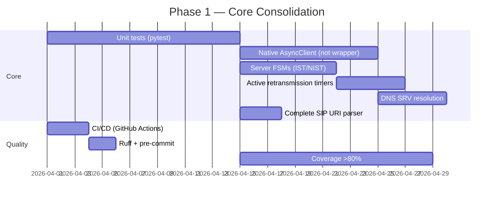

### Phase 2 -- Media Layer (Priority: CRITICAL)


### Phase 3 -- Automation / AI (Priority: HIGH)

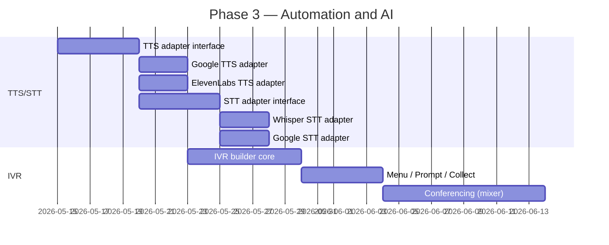

### Phase 4 -- Extensions (Priority: MEDIUM)

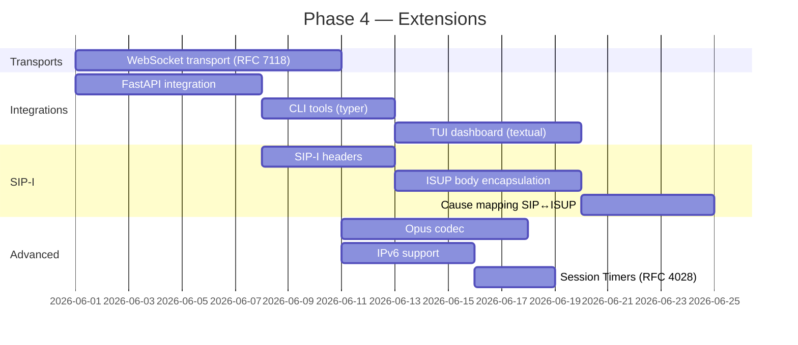

---

## 10. Design Patterns

### 10.1 Patterns Used

| Pattern                 | Where          | Description                                             |
| ----------------------- | -------------- | ------------------------------------------------------- |
| **Strategy**            | Transports     | `BaseTransport` -> pluggable UDP/TCP/TLS                |
| **Observer**            | Events         | `@event_handler` + `Events._call_*_handlers()`          |
| **State Machine**       | FSM            | `Transaction.transition_to()`, `Dialog.transition_to()` |
| **Factory**             | Auth           | `Auth.Digest()` returns `SipAuthCredentials`            |
| **Template Method**     | SIPMessage ABC | `to_bytes()`, `content`, `headers`                      |
| **Lazy Initialization** | Body parsing   | `response.body` parses on first access                  |
| **Context Manager**     | Client/Server  | `with Client() as c:` / `async with AsyncClient()`      |
| **Decorator**           | event_handler  | `@event_handler('INVITE', status=200)`                  |
| **Builder**             | SDPBody        | `SDPBody.create_offer()`, `.add_media()`                |

### 10.2 Principles

1. **Explicit > Implicit** -- Authentication is manual (`retry_with_auth()`), not automatic
2. **Lazy by default** -- Bodies are parsed on demand
3. **Extensible via ABCs** -- All main components have abstract base classes
4. **httpx-compatible** -- Familiar API surface for Pythonistas
5. **Batteries included** -- Constants, reason phrases, compact forms included

---

## 11. Dependencies

### 11.1 Current

| Package   | Version  | Use                     | Required                             |
| --------- | -------- | ----------------------- | ------------------------------------ |
| `rich`    | >=14.1.0 | Console output, logging | Yes (consider making optional)       |
| `typer`   | >=0.17.4 | CLI framework           | No (contrib)                         |
| `textual` | >=6.1.0  | TUI framework           | No (contrib)                         |

### 11.2 Planned

| Package               | Use                 | Required        |
| --------------------- | ------------------- | --------------- |
| `anyio` or `asyncio`  | Native async        | Yes (stdlib)    |
| `cryptography`        | SRTP                | No (media)      |
| `numpy`               | Audio processing    | No (media)      |
| `google-cloud-speech` | TTS/STT             | No (contrib)    |
| `openai-whisper`      | Local STT           | No (contrib)    |
| `websockets`          | WebSocket transport | No (transport)  |

---

## 12. Tests (Planned)

```text
tests/
├── conftest.py                    # Fixtures (mock transport, PBX)
├── test_client.py                 # Client methods
├── test_async_client.py           # AsyncClient
├── test_events.py                 # Event system
├── test_fsm.py                    # Transaction/Dialog states
├── test_server.py                 # SIPServer
├── models/
│   ├── test_message.py            # Request/Response/Parser
│   ├── test_header.py             # Headers case-insensitivity
│   ├── test_body.py               # SDPBody, Offer/Answer
│   └── test_auth.py               # Digest auth, challenge parsing
├── transports/
│   ├── test_udp.py                # UDP transport
│   ├── test_tcp.py                # TCP transport
│   └── test_tls.py                # TLS transport
├── media/                         # (future)
│   ├── test_rtp.py
│   ├── test_dtmf.py
│   └── test_codecs.py
└── integration/
    ├── test_asterisk.py           # Tests with Asterisk Docker
    └── test_e2e.py                # End-to-end flows
```

---

## 13. Glossary

| Term      | Definition                                                     |
| --------- | -------------------------------------------------------------- |
| **SIP**   | Session Initiation Protocol -- signaling protocol for VoIP     |
| **SDP**   | Session Description Protocol -- describes media parameters     |
| **RTP**   | Real-time Transport Protocol -- real-time media transport       |
| **SRTP**  | Secure RTP -- RTP with encryption                              |
| **DTMF**  | Dual-Tone Multi-Frequency -- dialing tones                     |
| **IVR**   | Interactive Voice Response -- automated voice menu system       |
| **TTS**   | Text-to-Speech -- voice synthesis                              |
| **STT**   | Speech-to-Text -- voice recognition                            |
| **UAC**   | User Agent Client -- initiates the SIP request                 |
| **UAS**   | User Agent Server -- receives the SIP request                  |
| **ICT**   | INVITE Client Transaction                                      |
| **NICT**  | Non-INVITE Client Transaction                                  |
| **IST**   | INVITE Server Transaction                                      |
| **NIST**  | Non-INVITE Server Transaction                                  |
| **SIP-I** | SIP with encapsulated ISUP                                     |
| **ISUP**  | ISDN User Part -- telephony signaling protocol                 |
| **PBX**   | Private Branch Exchange -- private telephone exchange           |

---

## Appendix A -- Implemented SIP Methods

| Method    | RFC  | `Client`  | `AsyncClient` | Description                  |
| --------- | ---- | --------- | ------------- | ---------------------------- |
| INVITE    | 3261 | ✅        | ✅            | Initiate call                |
| ACK       | 3261 | ✅        | ✅            | Confirm INVITE               |
| BYE       | 3261 | ✅        | ✅            | End call                     |
| CANCEL    | 3261 | ✅        | ✅            | Cancel pending INVITE        |
| REGISTER  | 3261 | ✅        | ✅            | Register location            |
| OPTIONS   | 3261 | ✅        | ✅            | Query capabilities           |
| MESSAGE   | 3428 | ✅        | ✅            | Instant message              |
| SUBSCRIBE | 3265 | ✅ (stub) | ✅ (stub)     | Subscribe to events          |
| NOTIFY    | 3265 | ✅ (stub) | ✅ (stub)     | Notify event                 |
| REFER     | 3515 | ✅ (stub) | ✅ (stub)     | Call transfer                |
| INFO      | 2976 | ✅        | ✅            | Mid-dialog information (DTMF)|
| UPDATE    | 3311 | ✅ (stub) | ✅ (stub)     | Update session               |
| PRACK     | 3262 | ✅ (stub) | ✅ (stub)     | Provisional ACK (100rel)     |
| PUBLISH   | 3903 | ✅ (stub) | ✅ (stub)     | Publish state                |

## Appendix B -- Supported Status Codes

All 60+ SIP status codes are defined in `_utils.py:REASON_PHRASES`:

- **1xx** Provisional: 100, 180, 181, 182, 183
- **2xx** Success: 200, 202
- **3xx** Redirection: 300, 301, 302, 305, 380
- **4xx** Client Error: 400-493 (21 codes)
- **5xx** Server Error: 500-513 (6 codes)
- **6xx** Global Failure: 600, 603, 604, 606
