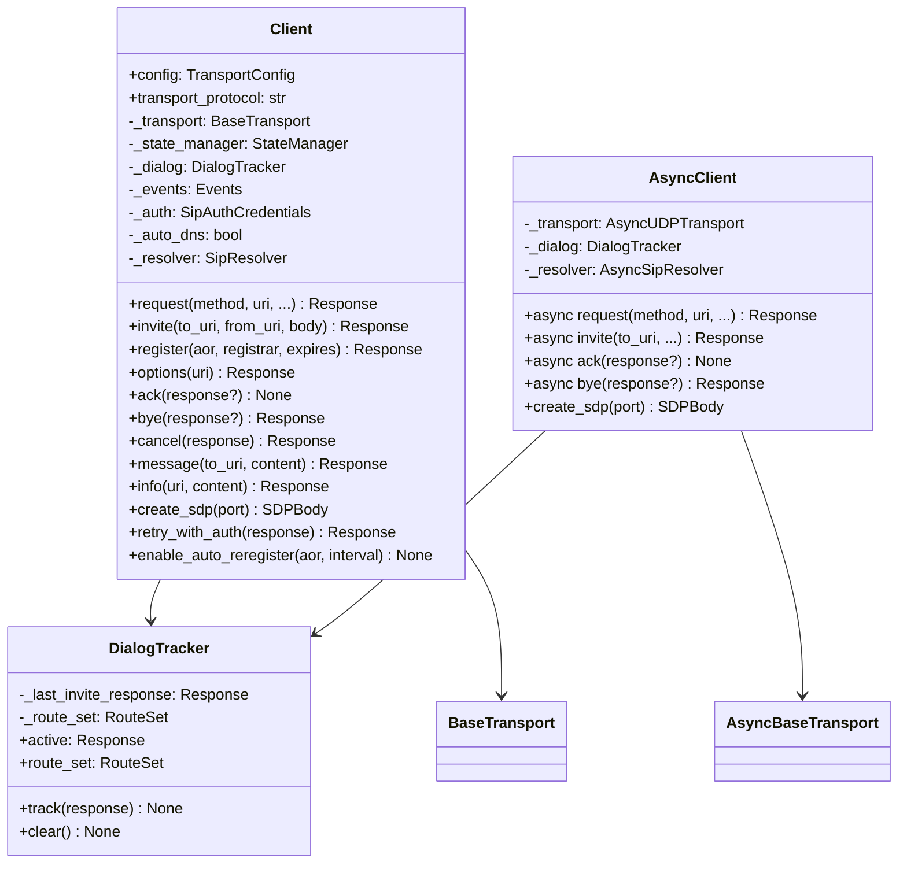
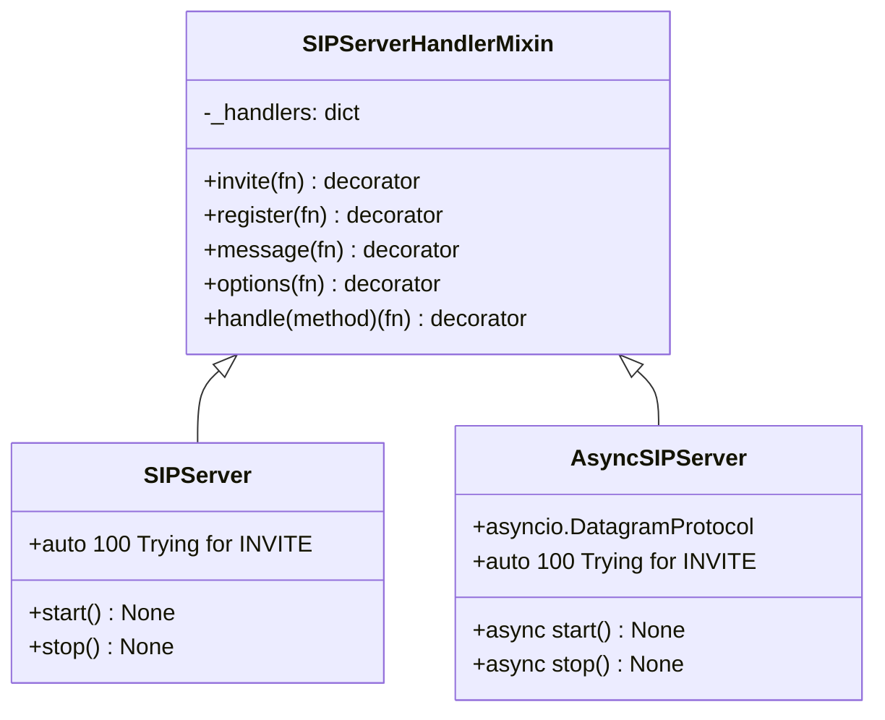
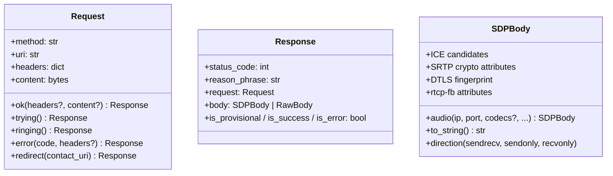
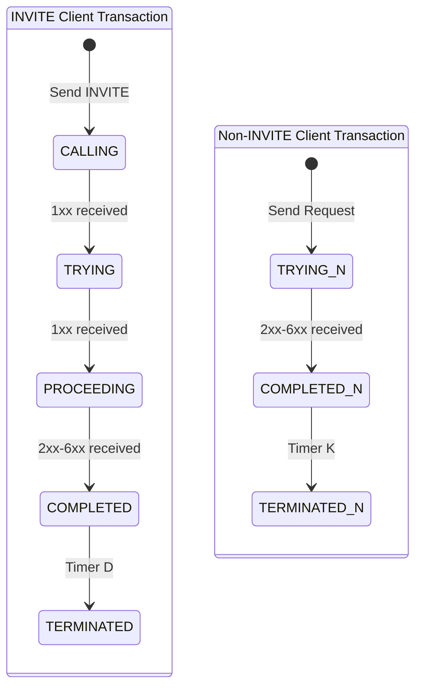
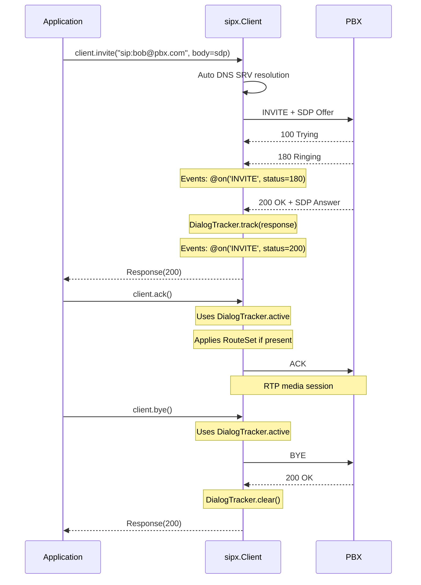
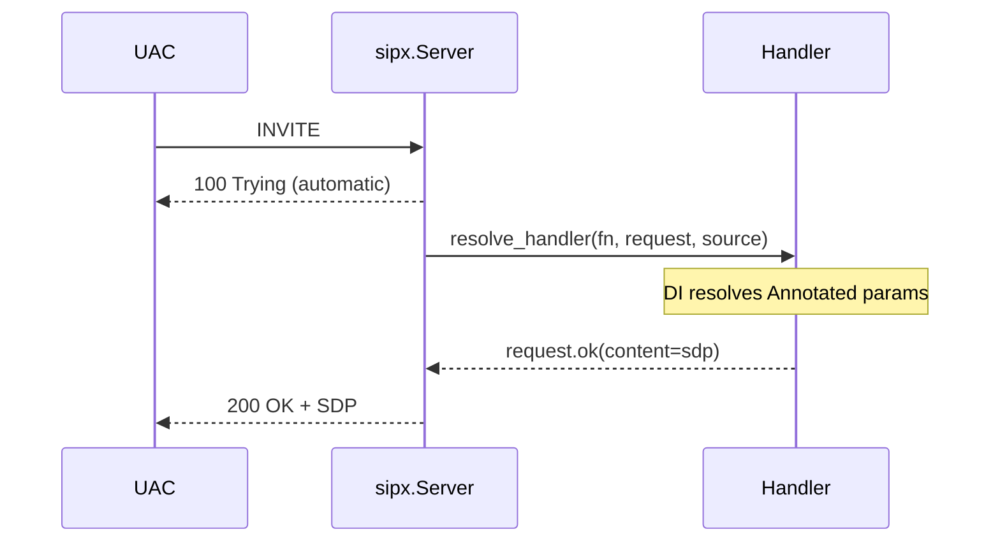
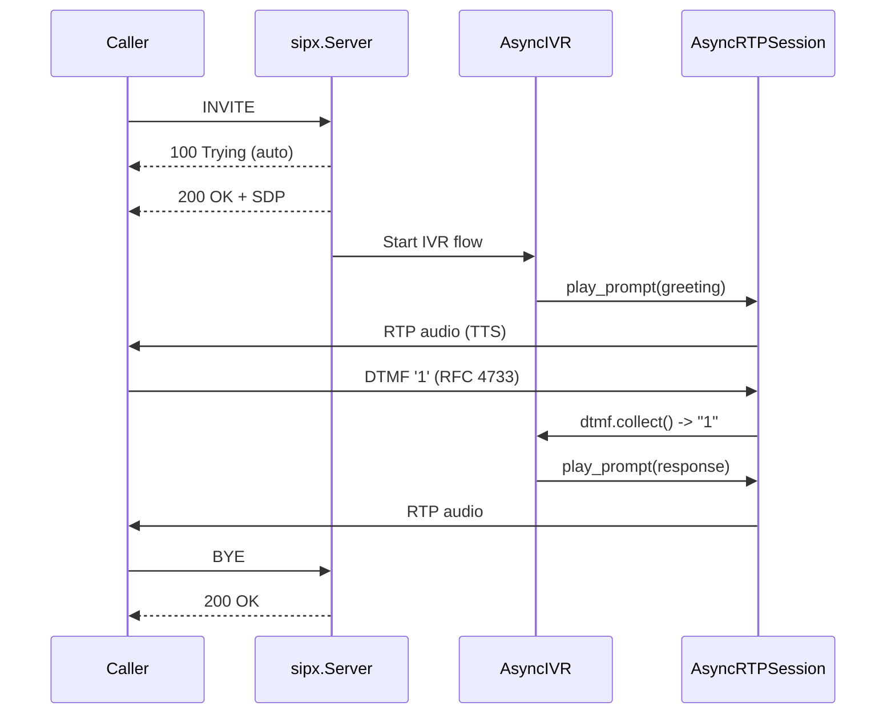
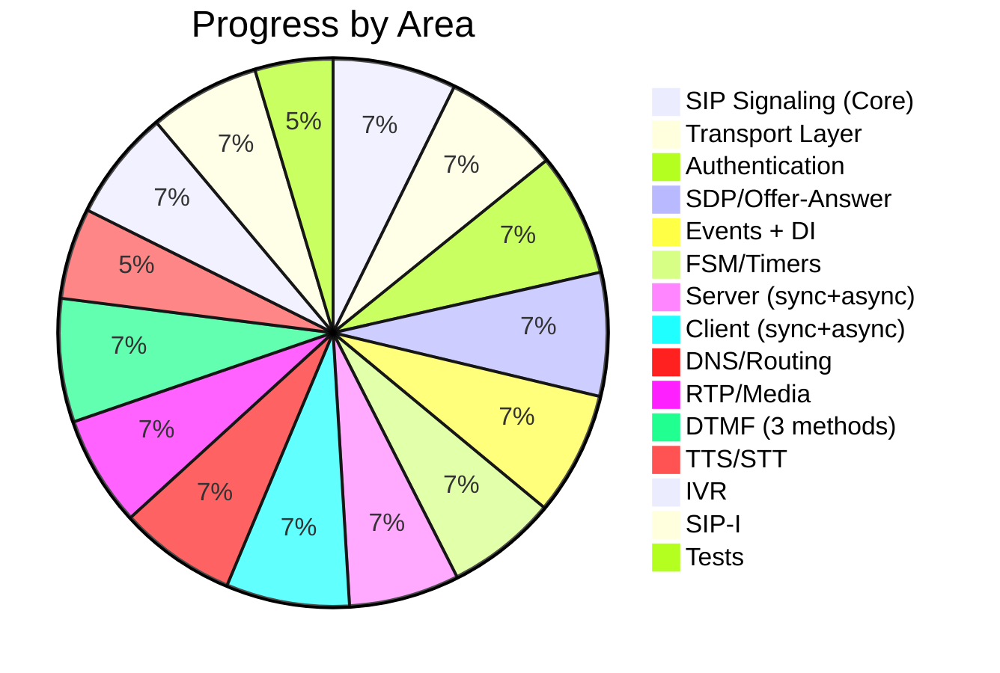

# sipx - Software Design Document (SDD)

> **Version:** 0.4.0
> **Date:** 2026-03-31
> **Status:** In development
> **Main inspiration:** [httpx](https://www.python-httpx.org/) -- Pythonic API, sync/async, extensible
> **Implementation references:** [sipd](https://github.com/initbar/sipd), [sipmessage](https://github.com/spacinov/sipmessage), [sip-parser](https://github.com/alxgb/sip-parser), [PySipIvr](https://github.com/ersansrck/PySipIvr), [sip-resources](https://github.com/miconda/sip-resources)
> **Other inspirations:** [pyVoIP](https://github.com/tayler6000/pyVoIP), [aiosip](https://github.com/Eyepea/aiosip), [pysipp](https://github.com/SIPp/pysipp), [PySIPio](https://pypi.org/project/PySIPio/), [b2bua](https://github.com/sippy/b2bua), [katariSIP](https://github.com/klocation/katarisip), [SIP-Auth-helper](https://github.com/pbertera/SIP-Auth-helper), [callsip.py](https://github.com/rundekugel/callsip.py)
> **Python:** 3.12+
> **License:** MIT

---

## 1. Overview

**sipx** is a SIP (Session Initiation Protocol) library for Python, inspired by httpx, designed to be **simple, high-performance, and extensible**. It enables creating everything from VoIP automation scripts to complete systems with IVR, TTS, STT, and AI integration.

### 1.1 Goals

| Goal | Description |
| --- | --- |
| **Simplicity** | Clean API inspired by httpx (`client.invite()`) and FastAPI (`@server.invite`, `Annotated` DI) |
| **Sync + Async** | `Client` / `AsyncClient` and `SIPServer` / `AsyncSIPServer` with the same API |
| **Declarative events** | `@on('INVITE', status=200)` as decorators |
| **FastAPI-style DI** | `Annotated[str, FromHeader]`, `Annotated[RTPSession, AutoRTP(port=8000)]` extractors |
| **Response builders** | `request.ok()`, `request.trying()`, `request.ringing()`, `request.error(code)` |
| **Dialog tracking** | `client.ack()` / `client.bye()` without passing response -- automatic dialog state |
| **RFC Compliance** | RFC 3261, 2617, 7616, 4566, 3264, 4733, 3550, 3263, 4028 and Brazilian SIP-I |
| **Media** | RTP, DTMF (3 methods), TTS/STT adapters, IVR builder, tone generators |
| **Extensibility** | Pluggable transports, body parsers, auth methods, custom extractors |

### 1.2 Target Audience

- Developers building VoIP/SIP automations
- AI-powered IVR systems (TTS/STT)
- CLI tools for SIP testing and diagnostics
- FastAPI applications with SIP signaling
- Brazilian telecom (SIP-I, ANATEL, ISUP-BR)

---

## 2. Architecture

### 2.1 Layer Diagram

```mermaid
graph TB
    subgraph "Application Layer"
        APP[Scripts / FastAPI / CLI / TUI]
    end

    subgraph "sipx Public API"
        CLIENT[Client / AsyncClient]
        SERVER[SIPServer / AsyncSIPServer]
        EVENTS[Events + @on decorator]
        DI[DI: Annotated + Extractors]
    end

    subgraph "Core"
        FSM[FSM<br/>StateManager + TimerManager]
        MODELS[Models<br/>Request / Response / Headers]
        SDP_MOD[SDP<br/>SDPBody / ICE / SRTP / DTLS]
        AUTH_MOD[Auth<br/>DigestAuth / Challenge]
        DNS[DNS<br/>SipResolver / AsyncSipResolver]
        URI[SipURI Parser]
        ROUTING[RouteSet / Record-Route]
        SESSION[Session Timers / Subscription]
    end

    subgraph "Transport Layer"
        BASE[BaseTransport / AsyncBaseTransport]
        UDP[UDPTransport + AsyncUDPTransport]
        TCP[TCPTransport + AsyncTCPTransport]
        TLS[TLSTransport + AsyncTLSTransport]
        WS[WebSocketTransport]
    end

    subgraph "Media Layer"
        RTP_MOD[RTPSession + AsyncRTPSession]
        DTMF_MOD[DTMF: RFC 4733 + SIP INFO + Inband]
        GEN[ToneGenerator / DTMFToneGenerator]
        CALL[CallSession / AsyncCallSession]
        TTS[TTS Adapter]
        STT[STT Adapter]
        CODEC[Codecs: G.711 + Opus]
    end

    subgraph "Contrib"
        IVR[IVR / AsyncIVR]
        SIPI[SIP-I: ISUP binary encoding]
        SIPIBR[SIP-I BR: ANATEL + ATI]
    end

    APP --> CLIENT
    APP --> SERVER
    CLIENT --> EVENTS
    CLIENT --> DI
    CLIENT --> FSM
    CLIENT --> MODELS
    CLIENT --> BASE
    CLIENT --> DNS
    CLIENT --> ROUTING
    SERVER --> DI
    EVENTS --> MODELS
    FSM --> MODELS
    MODELS --> SDP_MOD
    MODELS --> AUTH_MOD
    BASE --> UDP
    BASE --> TCP
    BASE --> TLS
    BASE --> WS
    CLIENT --> RTP_MOD
    RTP_MOD --> DTMF_MOD
    RTP_MOD --> GEN
    RTP_MOD --> CALL
    IVR --> RTP_MOD
    IVR --> TTS
    SIPI --> MODELS
```



### 2.2 Package Structure

```text
sipx/
├── __init__.py            # Public API exports
├── main.py                # CLI entry point
├── _events.py             # Events + @on decorator
├── _depends.py            # DI: Annotated extractors (FromHeader, AutoRTP, Source, etc.)
├── _routing.py            # RouteSet / Record-Route processing (RFC 3261 Section 16)
├── _uri.py                # SipURI parser (RFC 3986)
├── _types.py              # Enums, DataClasses, Exceptions, Type Aliases
├── _utils.py              # Constants, logging, reason phrases
│
├── client/
│   ├── __init__.py        # Re-exports: Client, AsyncClient
│   ├── _base.py           # Shared helpers, DialogTracker
│   ├── _sync.py           # Client (sync, with auto DNS, dialog tracking)
│   └── _async.py          # AsyncClient (native asyncio, DatagramProtocol)
│
├── server/
│   ├── __init__.py        # Re-exports: SIPServer, AsyncSIPServer
│   ├── _base.py           # SIPServerHandlerMixin (decorators, DI)
│   ├── _sync.py           # SIPServer (threading)
│   └── _async.py          # AsyncSIPServer (asyncio.DatagramProtocol)
│
├── models/
│   ├── __init__.py        # Re-exports
│   ├── _message.py        # Request (with ok/error/trying/ringing), Response, MessageParser
│   ├── _header.py         # Headers (case-insensitive, compact forms, RFC ordering)
│   ├── _body.py           # SDPBody (ICE, SRTP crypto, DTLS, rtcp-fb, direction), RawBody
│   └── _auth.py           # DigestAuth, DigestChallenge, AuthParser
│
├── transports/
│   ├── __init__.py        # Re-exports, TransportConfig, TransportAddress
│   ├── _base.py           # BaseTransport (ABC), AsyncBaseTransport (ABC)
│   ├── _udp.py            # UDPTransport, AsyncUDPTransport
│   ├── _tcp.py            # TCPTransport, AsyncTCPTransport
│   ├── _tls.py            # TLSTransport, AsyncTLSTransport
│   ├── _ws.py             # WebSocketTransport (RFC 7118)
│   └── _utils.py          # Transport utilities
│
├── fsm/
│   ├── __init__.py        # Re-exports: StateManager, TimerManager, AsyncTimerManager
│   ├── _manager.py        # StateManager (transactions + dialogs)
│   ├── _models.py         # Transaction, Dialog dataclasses
│   └── _timer.py          # TimerManager (sync), AsyncTimerManager (async)
│
├── dns/
│   ├── __init__.py        # Re-exports
│   ├── _models.py         # ResolvedTarget dataclass
│   ├── _sync.py           # SipResolver (SRV + A fallback)
│   └── _async.py          # AsyncSipResolver (native async)
│
├── session/
│   ├── __init__.py        # Re-exports
│   ├── _timer.py          # SessionTimer, AsyncSessionTimer (RFC 4028)
│   └── _subscription.py   # Subscription, AsyncSubscription
│
├── media/
│   ├── __init__.py        # Re-exports: RTPSession, AsyncRTPSession, etc.
│   ├── _rtp.py            # RTPPacket, RTPSession (sync)
│   ├── _async.py          # AsyncRTPSession (DatagramProtocol), AsyncDTMFHelper
│   ├── _dtmf.py           # DTMFEvent, DTMFSender, DTMFCollector
│   ├── _session.py        # CallSession, AsyncCallSession
│   ├── _generators.py     # ToneGenerator, DTMFToneGenerator
│   ├── _codecs.py         # G.711 PCMU/PCMA encode/decode
│   ├── _opus.py           # Opus codec adapter
│   ├── _audio.py          # AudioPlayer, AudioRecorder
│   ├── _tts.py            # BaseTTS adapter interface
│   ├── _stt.py            # BaseSTT adapter interface
│   ├── _pyaudio.py        # PyAudio adapter (mic/speaker I/O)
│   ├── rtp/               # Re-export namespace
│   ├── dtmf/              # Re-export namespace
│   ├── session/           # Re-export namespace
│   ├── audio/             # Re-export namespace
│   └── codecs/            # Re-export namespace
│
└── contrib/
    ├── __init__.py        # Re-exports
    ├── _isup.py           # Real ISUP binary encoding (ITU-T Q.763)
    ├── _sipi.py           # SIP-I international (multipart/mixed)
    ├── _sipi_br.py        # SIP-I BR: ANATEL, ATI, AsyncATI, ISUP-BR
    ├── _fastapi.py        # FastAPI integration adapter
    ├── _tts_google.py     # Google TTS adapter
    ├── _stt_whisper.py    # Whisper STT adapter
    └── ivr/
        ├── __init__.py    # Re-exports: IVR, AsyncIVR, Menu, Prompt
        ├── _models.py     # Menu, MenuItem, Prompt dataclasses
        ├── _sync.py       # IVR controller (sync)
        └── _async.py      # AsyncIVR controller (native async)
```

---

## 3. RFC Compliance

### 3.1 Implemented RFCs

| RFC | Title | Module | Status |
| --- | --- | --- | --- |
| **3261** | SIP: Session Initiation Protocol | `client/`, `server/`, `models/`, `fsm/` | ✅ Core + auto 100 Trying |
| **2617** | HTTP Digest Authentication | `models/_auth.py` | ✅ Complete |
| **7616** | HTTP Digest (SHA-256) | `models/_auth.py` | ✅ Complete |
| **8760** | Digest Algorithm Comparison | `models/_auth.py` | ✅ Complete |
| **4566** | SDP: Session Description Protocol | `models/_body.py` | ✅ Complete + ICE/SRTP/DTLS |
| **3264** | Offer/Answer Model with SDP | `models/_body.py` | ✅ Complete |
| **3550** | RTP: Real-time Transport Protocol | `media/_rtp.py`, `media/_async.py` | ✅ Sync + Async |
| **4733** | DTMF via RTP (telephone-event) | `media/_dtmf.py` | ✅ Send + Collect |
| **2976** | SIP INFO Method | `client/` | ✅ DTMF via SIP INFO |
| **3263** | SIP DNS/SRV Resolution | `dns/` | ✅ Sync + Async, auto in Client |
| **4028** | Session Timers | `session/_timer.py` | ✅ Sync + Async |
| **3581** | Symmetric Response (rport) | `client/` (Via header) | ✅ Complete |
| **3986** | URI Syntax | `_uri.py` | ✅ SipURI parser |

### 3.2 Partially Implemented

| RFC | Title | Status | Notes |
| --- | --- | --- | --- |
| **3711** | SRTP | ⚠️ SDP attributes | Crypto attributes in SDP, no packet encryption |
| **5765** | SIP-I (ISUP interworking) | ⚠️ Encoding done | Real ISUP binary, no full call flow |
| **7118** | SIP over WebSocket | ⚠️ Transport exists | Basic implementation |
| **3262** | PRACK (100rel) | ⚠️ Stub | Method exists, no full flow |
| **3265** | SUBSCRIBE/NOTIFY | ⚠️ Stub + Subscription | Methods + async subscription model |

### 3.3 Not Yet Implemented

| RFC | Title | Priority |
| --- | --- | --- |
| **3711** | SRTP packet encryption | HIGH |
| **3550** | RTCP (control protocol) | MEDIUM |
| **5765** | Full SIP-I call flow | MEDIUM |
| **3327** | Path Header | LOW |
| **6665** | Event Framework (full) | LOW |

### 3.4 SIP-I (Brazil/International)

| Spec | Title | Status |
| --- | --- | --- |
| ITU-T Q.1912.5 | SIP-I: ISUP/SIP Interworking | ✅ Real ISUP binary encoding (IAM/ACM/ANM/REL/RLC) |
| ITU-T Q.763 | ISUP parameters/encoding | ✅ BCD phone encoding, parameter serialization |
| ANATEL Res. 717 | Brazilian VoIP Regulation | ✅ SIP-I BR: ATI, AsyncATI, ISUP-BR headers |
| SIP-I Headers | P-Charging-Vector, P-Access-Network, Reason Q.850 | ✅ Implemented |

---

## 4. Detailed Components

### 4.1 Client (`client/`)



**Key features:**

- `client.ack()` / `client.bye()` without response param (uses tracked dialog)
- `client.create_sdp(port=8000)` creates SDP from client's local address
- Auto DNS SRV resolution (`auto_dns=True` by default)
- RouteSet applied automatically in ack/bye
- FSM Timer A/E retransmission with 500ms polling

**API examples:**

```python
# httpx-style one-liners
response = sipx.options("sip:pbx.example.com")
response = sipx.register("sip:alice@pbx.com", auth=("alice", "secret"))

# Client with dialog tracking
with Client(local_port=5061) as client:
    client.auth = ("alice", "secret")
    sdp = client.create_sdp(port=8000)
    r = client.invite("sip:bob@pbx.com", body=sdp.to_string())
    client.ack()      # uses tracked dialog
    time.sleep(5)
    client.bye()      # uses tracked dialog

# Native async (no threading wrapper)
async with AsyncClient() as client:
    r = await client.invite("sip:bob@pbx.com", body=sdp.to_string())
    await client.ack()
    await client.bye()
```

### 4.2 Server (`server/`)



**FastAPI-style handlers with DI:**

```python
server = SIPServer(local_host="0.0.0.0", local_port=5060)

@server.invite
def on_invite(
    request: Request,
    caller: Annotated[str, FromHeader],
    rtp: Annotated[RTPSession, AutoRTP(port=8000)],
):
    return request.ok(
        headers={"Content-Type": "application/sdp"},
        content=SDPBody.audio(ip="10.0.0.1", port=8000).to_string(),
    )

@server.register
def on_register(request: Request):
    return request.ok()

@server.handle("SUBSCRIBE")
def on_subscribe(request: Request, event: Annotated[str, Header("Event")]):
    return request.ok()
```

**Auto 100 Trying:** The server automatically sends `100 Trying` for INVITE requests before calling the handler (RFC 3261 Section 8.2.6.1).

### 4.3 Request Response Builders

```python
# Before (6+ lines of boilerplate per handler):
return Response(
    status_code=200,
    headers={
        "Via": request.via or "",
        "From": request.from_header or "",
        "To": request.to_header or "",
        "Call-ID": request.call_id or "",
        "CSeq": request.cseq or "",
        "Content-Length": "0",
    },
)

# After (1 line):
return request.ok()
return request.ok(headers={"Contact": "<sip:x>"}, content=sdp)
return request.trying()
return request.ringing()
return request.error(404)
return request.redirect("sip:other@host")
```

### 4.4 Dependency Injection (`_depends.py`)

Built-in extractors resolve handler parameters via `typing.Annotated`:

| Extractor | Extracts | Example |
| --- | --- | --- |
| `FromHeader` | From header value | `caller: Annotated[str, FromHeader]` |
| `ToHeader` | To header value | `dest: Annotated[str, ToHeader]` |
| `CallID` | Call-ID header | `cid: Annotated[str, CallID]` |
| `Header(name)` | Any header by name | `ua: Annotated[str, Header("User-Agent")]` |
| `Source` | Source transport address | `src: Annotated[TransportAddress, Source]` |
| `AutoRTP(port)` | RTPSession from SDP | `rtp: Annotated[RTPSession, AutoRTP(port=8000)]` |
| Custom `Extractor` | User-defined | Subclass `Extractor` with `extract(request, source)` |

### 4.5 Events System (`_events.py`)

```python
class MyEvents(Events):
    @on('INVITE', status=200)
    def on_call_accepted(self, request, response, context):
        ...

    @on('INVITE', status=(180, 183))
    def on_ringing(self, request, response, context):
        ...

    @on(status=(401, 407))
    def on_auth_required(self, request, response, context):
        ...

    @on(('REGISTER', 'INVITE'), status=200)
    def on_any_success(self, request, response, context):
        ...
```

### 4.6 Models (`models/`)



### 4.7 Transport Layer (`transports/`)

| Transport | Sync | Async | Notes |
| --- | --- | --- | --- |
| UDP | `UDPTransport` | `AsyncUDPTransport` | Connectionless, max 65535 bytes |
| TCP | `TCPTransport` | `AsyncTCPTransport` | Content-Length framing, keepalive |
| TLS | `TLSTransport` | `AsyncTLSTransport` | TLS 1.2+, cert verification |
| WebSocket | `WebSocketTransport` | -- | RFC 7118, basic |

### 4.8 FSM (`fsm/`)



- `TimerManager` (sync) / `AsyncTimerManager` (async) for RFC 3261 Timer A/B/E/F
- Automatic retransmission wired into Client.request()

### 4.9 Media Layer (`media/`)

| Component | Sync | Async | Description |
| --- | --- | --- | --- |
| RTP | `RTPSession` | `AsyncRTPSession` | DatagramProtocol, send/receive packets |
| DTMF | `DTMFSender` + `DTMFCollector` | `AsyncDTMFHelper` | RFC 4733 + SIP INFO + Inband |
| Call Session | `CallSession` | `AsyncCallSession` | High-level call abstraction |
| Tone Gen | `ToneGenerator` | -- | Sine wave PCM generation |
| DTMF Gen | `DTMFToneGenerator` | -- | Dual-tone DTMF audio (697+1477Hz etc.) |
| Codecs | G.711 PCMU/PCMA | -- | Encode/decode |
| Opus | `OpusCodec` | -- | Optional (requires opuslib) |
| TTS | `BaseTTS` | -- | Abstract adapter interface |
| STT | `BaseSTT` | -- | Abstract adapter interface |
| PyAudio | `PyAudioAdapter` | -- | Mic/speaker I/O (planned) |

### 4.10 Contrib

| Component | Description |
| --- | --- |
| `IVR` / `AsyncIVR` | Menu-driven IVR with TTS + DTMF collect |
| `Menu` / `Prompt` / `MenuItem` | IVR data models |
| `ISUPMessage` | Real ISUP binary encoding (ITU-T Q.763): IAM, ACM, ANM, REL, RLC |
| `SipI` | International SIP-I with multipart/mixed body |
| `SipIBR` | Brazilian SIP-I: ANATEL headers, ATI/AsyncATI portability |
| `GoogleTTSAdapter` | Google Cloud TTS integration |
| `WhisperSTTAdapter` | OpenAI Whisper STT integration |

---

## 5. Main Flows

### 5.1 Complete Call (INVITE -> ACK -> BYE)



### 5.2 Server with Auto 100 Trying



### 5.3 IVR Flow with DTMF



---

## 6. Requirements

### 6.1 SIP Signaling (Core)

| ID | Requirement | Status |
| --- | --- | --- |
| RF-01 | Send/receive all SIP methods (14 methods) | ✅ |
| RF-02 | Complete SIP message parsing | ✅ |
| RF-03 | Case-insensitive headers with compact forms | ✅ |
| RF-04 | Digest authentication (MD5, SHA-256) | ✅ |
| RF-05 | SDP Offer/Answer model | ✅ |
| RF-06 | Transaction FSM (ICT, NICT) | ✅ |
| RF-07 | Dialog state management | ✅ |
| RF-08 | Declarative event system | ✅ |
| RF-09 | SIP Server (sync + async) | ✅ |
| RF-10 | Transports UDP, TCP, TLS (sync + async) | ✅ |
| RF-11 | Auto re-registration | ✅ |
| RF-12 | Context manager (with/async with) | ✅ |
| RF-13 | DNS SRV resolution (RFC 3263) | ✅ |
| RF-14 | Route/Record-Route processing | ✅ |
| RF-15 | Automatic retransmission (Timer A/E) | ✅ |
| RF-16 | Session Timers (RFC 4028) | ✅ |
| RF-17 | Complete SIP URI parser | ✅ |
| RF-18 | Auto 100 Trying for INVITE | ✅ |
| RF-19 | Dialog tracking (implicit ack/bye) | ✅ |
| RF-20 | Response builders (request.ok/error/trying) | ✅ |
| RF-21 | Auto DNS in Client | ✅ |
| RF-22 | FastAPI-style DI with Annotated | ✅ |

### 6.2 SIP Signaling (Pending)

| ID | Requirement | Status | Priority |
| --- | --- | --- | --- |
| RF-23 | Server-side FSMs (IST, NIST) | ❌ | Medium |
| RF-24 | Forking (multiple responses) | ❌ | Medium |
| RF-25 | IPv6 support | ❌ | Medium |
| RF-26 | 100rel / complete PRACK | ⚠️ Stub | Medium |
| RF-27 | SCTP transport | ❌ | Low |

### 6.3 Media / RTP

| ID | Requirement | Status |
| --- | --- | --- |
| RF-30 | RTP send/receive (RFC 3550) | ✅ Sync + Async |
| RF-31 | DTMF via RTP (RFC 4733) | ✅ Send + Collect |
| RF-32 | DTMF via SIP INFO | ✅ |
| RF-33 | DTMF via Inband audio | ✅ |
| RF-34 | Codecs G.711 PCMU/PCMA | ✅ |
| RF-35 | Codec Opus | ⚠️ Adapter exists |
| RF-36 | Media negotiation | ✅ SDP + RTP |
| RF-37 | Hold/Resume (sendonly/recvonly) | ✅ SDP attributes |
| RF-38 | Early media (183) | ✅ Detection |
| RF-39 | Tone generation (sine waves) | ✅ |
| RF-40 | DTMF tone generation (dual-tone) | ✅ |

### 6.4 Media (Pending)

| ID | Requirement | Status | Priority |
| --- | --- | --- | --- |
| RF-41 | SRTP packet encryption (RFC 3711) | ❌ | HIGH |
| RF-42 | RTCP (RFC 3550) | ❌ | MEDIUM |
| RF-43 | Jitter buffer | ❌ | MEDIUM |
| RF-44 | Audio recording (RTP -> WAV) | ⚠️ Basic | Medium |
| RF-45 | Conferencing (mixer) | ❌ | Low |

### 6.5 Automation / AI

| ID | Requirement | Status |
| --- | --- | --- |
| RF-50 | TTS adapter interface | ✅ BaseTTS |
| RF-51 | STT adapter interface | ✅ BaseSTT |
| RF-52 | IVR builder (menu, prompts, DTMF) | ✅ Sync + Async |
| RF-53 | Audio file playback (WAV -> RTP) | ✅ |
| RF-54 | Google TTS adapter | ✅ |
| RF-55 | Whisper STT adapter | ✅ |

### 6.6 SIP-I / Brazil

| ID | Requirement | Status |
| --- | --- | --- |
| RF-60 | Real ISUP binary encoding (Q.763) | ✅ IAM/ACM/ANM/REL/RLC |
| RF-61 | SIP-I multipart/mixed body | ✅ |
| RF-62 | ISUP-BR (Brazilian extensions) | ✅ |
| RF-63 | ATI portability query (sync + async) | ✅ |
| RF-64 | P-Charging-Vector | ✅ |
| RF-65 | P-Access-Network-Info | ✅ |
| RF-66 | Reason header (Q.850 cause) | ✅ |

### 6.7 Non-Functional Requirements

| ID | Requirement | Status |
| --- | --- | --- |
| RNF-01 | Python 3.12+ | ✅ |
| RNF-02 | Zero heavy dependencies (core) | ✅ (only `rich`) |
| RNF-03 | Sync and async with the same API | ✅ Native async |
| RNF-04 | Type hints | ✅ |
| RNF-05 | Logging (no print in core) | ✅ |
| RNF-06 | Lazy parsing (body, auth challenge) | ✅ |
| RNF-07 | Unit tests >60% coverage | ✅ 607 tests |
| RNF-08 | CI/CD (GitHub Actions) | ❌ |
| RNF-09 | PyPI publishable | ⚠️ (not published) |
| RNF-10 | ABC-based extensibility | ✅ |

---

## 7. Inventory

### 7.1 Visual Summary



### 7.2 Statistics

| Metric | Value |
| --- | --- |
| Python source files | ~65 |
| Total LOC (excluding tests) | ~15,600 |
| Test files | 26 |
| Tests | 607 |
| Coverage | ~60% |
| Examples | 17 |

---

## 8. API Surface

### 8.1 Top-level Exports (`sipx/`)

```python
# Core
sipx.Client                    # Sync SIP client
sipx.AsyncClient               # Async SIP client (native asyncio)
sipx.Request                   # SIP Request (with ok/error/trying/ringing)
sipx.Response                  # SIP Response
sipx.SDPBody                   # SDP body builder

# Server
sipx.SIPServer                 # Sync SIP server
sipx.AsyncSIPServer            # Async SIP server (DatagramProtocol)

# Events
sipx.Events                    # Event handler base class
sipx.on                        # @on('INVITE', status=200) decorator

# DI Extractors
sipx.FromHeader                # Extract From header
sipx.ToHeader                  # Extract To header
sipx.CallID                    # Extract Call-ID
sipx.Header                    # Extract any header by name
sipx.Source                    # Extract source address
sipx.AutoRTP                   # Extract RTPSession from SDP
sipx.Extractor                 # Base class for custom extractors

# Auth
sipx.Auth                      # Auth factory

# One-liners
sipx.options(uri)              # Send OPTIONS
sipx.register(uri, auth=...)   # Send REGISTER
sipx.send(uri, text, auth=...) # Send MESSAGE
sipx.call(uri, auth=..., body=...) # Send INVITE
```

### 8.2 Media (`sipx.media/`)

```python
sipx.media.RTPSession          # Sync RTP send/receive
sipx.media.AsyncRTPSession     # Async RTP (DatagramProtocol)
sipx.media.CallSession         # Sync call session
sipx.media.AsyncCallSession    # Async call session
sipx.media.DTMFSender          # Send DTMF digits
sipx.media.DTMFCollector       # Collect DTMF digits
sipx.media.ToneGenerator       # Generate sine wave tones
sipx.media.DTMFToneGenerator   # Generate dual-tone DTMF audio
```

### 8.3 Contrib (`sipx.contrib/`)

```python
sipx.contrib.IVR               # Sync IVR controller
sipx.contrib.AsyncIVR          # Async IVR controller
sipx.contrib.Menu              # IVR menu model
sipx.contrib.Prompt            # IVR prompt model
sipx.contrib.SipI              # International SIP-I
sipx.contrib.SipIBR            # Brazilian SIP-I
sipx.contrib.ISUPMessage       # Real ISUP binary encoding
```

---

## 9. Roadmap

### Done (Phases 1-3)

- Core SIP signaling (14 methods, all sync + async)
- Native AsyncClient (not wrapper)
- FSM timers with automatic retransmission
- DNS SRV resolution (auto in Client)
- SIP URI parser
- SDP with ICE, SRTP crypto, DTLS, rtcp-fb
- RTP engine (sync + async)
- DTMF (3 methods: RFC 4733, SIP INFO, Inband)
- IVR builder (sync + async)
- TTS/STT adapter interfaces
- SIP-I (international + Brazilian) with real ISUP binary
- Session Timers (RFC 4028)
- Route/Record-Route processing
- Auto 100 Trying
- Response builders (request.ok/error/trying/ringing)
- Dialog tracking (implicit ack/bye)
- 607 tests, 60% coverage

### Remaining Work

| Feature | Priority | Complexity |
| --- | --- | --- |
| SRTP packet encryption | HIGH | High |
| RTCP (control protocol) | MEDIUM | Medium |
| Jitter buffer | MEDIUM | High |
| Server-side FSMs (IST/NIST) | MEDIUM | Medium |
| WebSocket transport (full) | MEDIUM | Medium |
| CI/CD (GitHub Actions) | MEDIUM | Low |
| Coverage >80% | MEDIUM | Medium |
| PyPI publishing | LOW | Low |
| IPv6 | LOW | Low |
| Conferencing (mixer) | LOW | High |

---

## 10. Design Patterns

| Pattern | Where | Description |
| --- | --- | --- |
| **Strategy** | Transports | `BaseTransport` -> pluggable UDP/TCP/TLS |
| **Observer** | Events | `@on()` + `Events._call_*_handlers()` |
| **State Machine** | FSM | `Transaction.transition_to()`, `Dialog.transition_to()` |
| **Factory** | Auth | `Auth.Digest()` returns `SipAuthCredentials` |
| **Builder** | Response | `request.ok()`, `request.error()`, `SDPBody.audio()` |
| **Template Method** | SIPMessage | `to_bytes()`, `to_string()` |
| **Lazy Initialization** | Body parsing, DNS | `response.body` parses on demand, DNS resolver lazy-inits |
| **Context Manager** | Client/Server | `with Client()` / `async with AsyncClient()` |
| **Decorator** | Events, Server | `@on('INVITE')`, `@server.invite` |
| **Dependency Injection** | Server handlers | `Annotated[str, FromHeader]` extractors |
| **Tracker** | Dialog | `DialogTracker` tracks INVITE 200 OK + RouteSet |

---

## 11. Dependencies

### Current

| Package | Version | Use | Required |
| --- | --- | --- | --- |
| `rich` | >=14.1.0 | Console output, logging | Yes |

### Optional

| Package | Use | When needed |
| --- | --- | --- |
| `dnspython` | DNS SRV resolution | When resolving SIP domains |
| `opuslib` | Opus codec | When using Opus audio |
| `pyaudio` | Mic/speaker I/O | Softphone mode |
| `google-cloud-texttospeech` | Google TTS | TTS integration |
| `openai-whisper` | Whisper STT | STT integration |

---

## 12. Glossary

| Term | Definition |
| --- | --- |
| **SIP** | Session Initiation Protocol -- signaling protocol for VoIP |
| **SDP** | Session Description Protocol -- describes media parameters |
| **RTP** | Real-time Transport Protocol -- real-time media transport |
| **SRTP** | Secure RTP -- RTP with encryption |
| **DTMF** | Dual-Tone Multi-Frequency -- dialing tones |
| **IVR** | Interactive Voice Response -- automated voice menu system |
| **TTS** | Text-to-Speech -- voice synthesis |
| **STT** | Speech-to-Text -- voice recognition |
| **UAC** | User Agent Client -- initiates the SIP request |
| **UAS** | User Agent Server -- receives the SIP request |
| **ICT** | INVITE Client Transaction |
| **NICT** | Non-INVITE Client Transaction |
| **SIP-I** | SIP with encapsulated ISUP |
| **ISUP** | ISDN User Part -- telephony signaling protocol |
| **PBX** | Private Branch Exchange -- private telephone exchange |
| **DI** | Dependency Injection |

---

## Appendix A -- Implemented SIP Methods

| Method | RFC | `Client` | `AsyncClient` | Description |
| --- | --- | --- | --- | --- |
| INVITE | 3261 | ✅ | ✅ | Initiate call |
| ACK | 3261 | ✅ | ✅ | Confirm INVITE (auto dialog) |
| BYE | 3261 | ✅ | ✅ | End call (auto dialog) |
| CANCEL | 3261 | ✅ | ✅ | Cancel pending INVITE |
| REGISTER | 3261 | ✅ | ✅ | Register location |
| OPTIONS | 3261 | ✅ | ✅ | Query capabilities |
| MESSAGE | 3428 | ✅ | ✅ | Instant message |
| SUBSCRIBE | 3265 | ✅ | ✅ | Subscribe to events |
| NOTIFY | 3265 | ✅ | ✅ | Notify event |
| REFER | 3515 | ✅ | ✅ | Call transfer |
| INFO | 2976 | ✅ | ✅ | Mid-dialog info (DTMF) |
| UPDATE | 3311 | ✅ | ✅ | Update session |
| PRACK | 3262 | ✅ | ✅ | Provisional ACK |
| PUBLISH | 3903 | ✅ | ✅ | Publish state |
